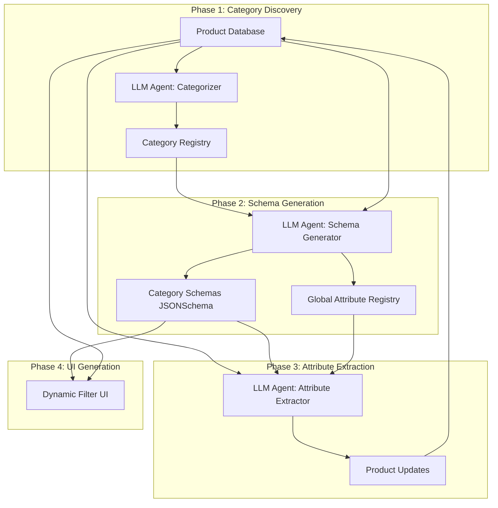

# Design Document

## Overview

The Product Categorization System is an LLM-powered agentic system that dynamically discovers, categorizes, and schemas product data for precise price comparisons. Unlike traditional rule-based systems, this design uses Large Language Models to:

1. **[MVP]** Categorize products into precise categories based on consumer substitutability (e.g., "lemon" vs "lime" are separate categories)
2. **[MVP]** Generate schemas for each category by analyzing actual product data and discovering relevant attributes
3. **[MVP]** Extract and normalize attributes from products using LLM reasoning
4. **[POST-MVP]** Enable dynamic UIs through JSONSchema-based filtering interfaces

The system focuses initially on vegetables and fruits ("Gemüse" and "Früchte" categories) and operates in three MVP phases: categorization → schema generation → attribute extraction.

This is an agentic system where LLMs make decisions based on full context of product data, rather than following predefined rules. The MVP relies entirely on LLM reasoning without maintaining separate knowledge bases.

## Architecture

### High-Level Architecture



### Agentic System Flow

**Phase 1: Category Discovery [MVP]**

1. LLM Agent receives all products in "Gemüse" and "Früchte"
2. Agent analyzes product names and groups by consumer substitutability
3. Agent creates precise categories (e.g., "lemon", "apple", "tomato-cherry")
4. Agent provides reasoning for each category
5. Categories stored in Category Registry
6. Agent assigns category to each product.

**Phase 2: Schema Generation [MVP]**

1. For each category, LLM Agent receives all products in that category
2. Agent analyzes product variations and identifies relevant explicit attributes
3. Agent checks Global Attribute Registry for existing attributes
4. Agent creates new attributes if needed (with normalized snake_case naming)
5. Agent generates JSONSchema for category with discovered attributes
6. Agent provides reasoning for schema structure
7. Schema stored and linked to category

**Phase 3: Attribute Extraction [MVP]**

1. For each product, LLM Agent receives product data + category schema
2. Agent extracts attribute values according to schema using LLM reasoning
3. Agent normalizes values using schema constraints (exact enum values)
4. Attributes validated against JSONSchema
5. Structured attributes stored in product JSONB field

**Phase 4: UI Generation [POST-MVP]**

1. Frontend reads category schemas via API
2. Dynamically generates filter UI from JSONSchema
3. Users filter products using discovered attributes
4. Queries use JSONB operators for efficient filtering

### Integration Points

- New database tables: `categories`, `category_schemas`, `global_attributes`
- LLM integration layer for agent operations
- Extends existing `products` table with `category_id` foreign key
- Uses PostgreSQL JSONB for flexible attribute storage
- API endpoints for category/schema management

## Components and Interfaces

### 1. LLM Agent Orchestrator

**Purpose**: Coordinate LLM agent operations across all phases.

**Interface**:

```typescript
interface LLMAgentOrchestrator {
  /**
   * Run complete categorization pipeline
   */
  runFullPipeline(categoryFilter: string[]): Promise<PipelineResult>;

  /**
   * Run specific phase
   */
  runPhase(phase: AgentPhase): Promise<PhaseResult>;

  /**
   * Get pipeline status
   */
  getStatus(): PipelineStatus;
}

enum AgentPhase {
  CATEGORY_DISCOVERY = "CATEGORY_DISCOVERY",
  SCHEMA_GENERATION = "SCHEMA_GENERATION",
  ATTRIBUTE_EXTRACTION = "ATTRIBUTE_EXTRACTION",
}

interface PipelineResult {
  categoriesCreated: number;
  schemasGenerated: number;
  productsProcessed: number;
  errors: AgentError[];
  duration: number;
}
```

### 2. Category Discovery Agent

**Purpose**: Analyze products and create precise categories based on consumer substitutability.

**Interface**:

```typescript
interface CategoryDiscoveryAgent {
  /**
   * Discover categories from product list
   * This is the main method that analyzes all products and returns discovered categories
   * The LLM handles validation internally based on consumer substitutability rules
   */
  discoverCategories(products: ProductSummary[]): Promise<DiscoveredCategory[]>;
}

interface ProductSummary {
  id: number;
  name: string;
  supermarket: string;
  unit: string | null;
  price: number | null;
}

interface DiscoveredCategory {
  name: string; // e.g., "lemon", "apple", "tomato-cherry"
  displayName: string; // e.g., "Lemon", "Apple", "Cherry Tomato"
  productIds: number[];
  reasoning: string; // [MVP] LLM explanation for category
  confidence: number; // [POST-MVP] Confidence score
}
```

**LLM Prompt Strategy**:

```
You are analyzing grocery products to create precise categories for price comparison.

Rules:
1. Group products that consumers would reasonably substitute for each other
2. Separate products that consumers would NOT substitute (e.g., lemon vs lime)
3. Consider variety, type, and form as category boundaries
4. Use clear, consistent naming (lowercase-kebab-case)

Input: List of {product_count} products.
Output: JSON array of categories with product IDs and reasoning

Example:
{
  "name": "lemon",
  "displayName": "Lemon",
  "productIds": [123, 456, 789],
  "reasoning": "All products are lemons, regardless of organic status or size"
}
```

### 3. Schema Generation Agent

**Purpose**: Generate JSONSchema for each category by analyzing products and discovering attributes.

**Interface**:

```typescript
interface SchemaGenerationAgent {
  /**
   * Generate schema for a category
   */
  generateSchema(
    category: DiscoveredCategory,
    products: Product[],
    globalAttributes: GlobalAttribute[]
  ): Promise<GeneratedSchema>;

  /**
   * Register new attributes in global registry
   */
  registerAttributes(attributes: AttributeDefinition[]): Promise<void>;
}

interface GeneratedSchema {
  categoryId: number;
  schema: JSONSchema;
  newAttributes: AttributeDefinition[];
  existingAttributes: string[];
  reasoning: string;
}

interface AttributeDefinition {
  name: string; // Normalized name (e.g., "organic_certification")
  displayName: string; // UI label (e.g., "Organic Certification")
  type: "string" | "number" | "boolean" | "enum";
  enumValues?: string[]; // For enum types
  description: string;
  unit?: string; // For numeric attributes
}

interface GlobalAttribute {
  id: number;
  name: string;
  displayName: string;
  type: string;
  enumValues: string[] | null;
  description: string;
  usageCount: number; // [POST-MVP] How many categories use this
}
```

**LLM Prompt Strategy**:

```
You are generating a JSONSchema for product category "{category_name}".

Context:
- Category: {category_display_name}
- Product count: {product_count}
- Sample products: {product_samples}
- Existing global attributes: {global_attributes}

Tasks:
1. Analyze product variations within this category
2. Identify attributes that differentiate products (e.g., organic, size, variety)
3. Reuse existing global attributes when possible
4. Create new attributes with normalized naming (snake_case)
5. Generate JSONSchema with appropriate types and constraints

Naming conventions:
- Use snake_case for attribute names
- Use clear, descriptive names
- Prefer enums over free text when values are limited
- Include units for numeric values

Output: JSON with schema and attribute definitions
```

### 4. Attribute Extraction Agent

**Purpose**: Extract and normalize attribute values for products according to category schema.

**Interface**:

```typescript
interface AttributeExtractionAgent {
  /**
   * Extract attributes for a product
   * The schema contains all necessary information for extraction
   */
  extractAttributes(
    product: Product,
    schema: JSONSchema
  ): Promise<ExtractedAttributes>;

  /**
   * Batch extract for multiple products in the same category
   * More efficient than individual extraction for large datasets
   */
  extractBatch(
    products: Product[],
    schema: JSONSchema,
    batchSize: number
  ): Promise<BatchExtractionResult>;
}

interface ExtractedAttributes {
  productId: number;
  categoryId: number;
  attributes: Record<string, any>; // Conforms to JSONSchema
  confidence: number; // [POST-MVP] Confidence score
  reasoning: string; // [POST-MVP] Extraction reasoning
}

interface BatchExtractionResult {
  extracted: ExtractedAttributes[];
  errors: ExtractionError[];
  totalProcessed: number;
}
```

**LLM Prompt Strategy**:

```
You are extracting attributes for a product according to its category schema.

Product:
- Name: {product_name}
- Supermarket: {supermarket}
- Unit: {unit}
- Price: {price}

Category Schema:
{json_schema}

Tasks:
1. Extract attribute values from product name and metadata
2. Normalize values according to schema constraints
3. Use enum values exactly as defined in the schema
4. [POST-MVP] Use your knowledge to infer implicit attributes (e.g., "sweet" for Gala apples)

Output: JSON with extracted attributes conforming to schema
```

### 5. Category Registry

**Purpose**: Store and manage discovered categories.

**Interface**:

```typescript
interface CategoryRegistry {
  /**
   * Create new category
   */
  createCategory(category: DiscoveredCategory): Promise<Category>;

  /**
   * Get category by ID
   */
  getCategory(id: number): Promise<Category>;

  /**
   * Get all categories
   */
  getAllCategories(): Promise<Category[]>;

  /**
   * Update category
   */
  updateCategory(id: number, updates: Partial<Category>): Promise<Category>;

  /**
   * Assign products to category
   */
  assignProducts(categoryId: number, productIds: number[]): Promise<void>;
}

interface Category {
  id: number;
  name: string;
  displayName: string;
  productCount: number;
  schemaId: number | null;
  createdAt: Date;
  updatedAt: Date;
}
```

### 6. Schema Repository

**Purpose**: Store and manage category schemas and global attributes.

**Interface**:

```typescript
interface SchemaRepository {
  /**
   * Save category schema
   */
  saveSchema(categoryId: number, schema: JSONSchema): Promise<CategorySchema>;

  /**
   * Get schema for category
   */
  getSchema(categoryId: number): Promise<CategorySchema>;

  /**
   * Register global attribute
   */
  registerAttribute(attribute: AttributeDefinition): Promise<GlobalAttribute>;

  /**
   * Get all global attributes
   */
  getGlobalAttributes(): Promise<GlobalAttribute[]>;
}

interface CategorySchema {
  id: number;
  categoryId: number;
  schema: JSONSchema;
  version: number;
  createdAt: Date;
}
```

### 7. LLM Client

**Purpose**: Abstract LLM API interactions with retry logic and error handling.

**Interface**:

```typescript
interface LLMClient {
  /**
   * Send prompt to LLM and get structured response
   */
  complete<T>(
    prompt: string,
    schema: JSONSchema,
    options?: CompletionOptions
  ): Promise<LLMResponse<T>>;

  /**
   * Stream completion for long-running operations
   */
  stream<T>(
    prompt: string,
    schema: JSONSchema,
    onChunk: (chunk: string) => void
  ): Promise<LLMResponse<T>>;
}

interface CompletionOptions {
  temperature?: number;
  maxTokens?: number;
  retries?: number;
  timeout?: number;
}

interface LLMResponse<T> {
  data: T;
  usage: {
    promptTokens: number;
    completionTokens: number;
    totalTokens: number;
  };
  model: string;
  finishReason: string;
}
```

## Data Models

### Database Schema

```sql
-- Categories table
CREATE TABLE categories (
    id SERIAL PRIMARY KEY,
    name TEXT NOT NULL UNIQUE,
    display_name TEXT NOT NULL,
    product_count INTEGER DEFAULT 0,
    schema_id INTEGER,
    reasoning TEXT,
    confidence DECIMAL(3, 2),
    created_at TIMESTAMP DEFAULT CURRENT_TIMESTAMP,
    updated_at TIMESTAMP DEFAULT CURRENT_TIMESTAMP
);

CREATE INDEX idx_categories_name ON categories(name);

-- Category schemas table
CREATE TABLE category_schemas (
    id SERIAL PRIMARY KEY,
    category_id INTEGER NOT NULL REFERENCES categories(id),
    schema JSONB NOT NULL,
    version INTEGER DEFAULT 1,
    created_at TIMESTAMP DEFAULT CURRENT_TIMESTAMP,
    UNIQUE(category_id, version)
);

CREATE INDEX idx_category_schemas_category ON category_schemas(category_id);

-- Global attributes registry
CREATE TABLE global_attributes (
    id SERIAL PRIMARY KEY,
    name TEXT NOT NULL UNIQUE,
    display_name TEXT NOT NULL,
    type TEXT NOT NULL,
    enum_values TEXT[],
    description TEXT,
    unit TEXT,
    usage_count INTEGER DEFAULT 0,
    created_at TIMESTAMP DEFAULT CURRENT_TIMESTAMP,
    updated_at TIMESTAMP DEFAULT CURRENT_TIMESTAMP
);

CREATE INDEX idx_global_attributes_name ON global_attributes(name);

-- Extend products table
ALTER TABLE products
ADD COLUMN category_id INTEGER REFERENCES categories(id),
ADD COLUMN categorization_confidence DECIMAL(3, 2),
ADD COLUMN attributes_extracted_at TIMESTAMP;

CREATE INDEX idx_products_category ON products(category_id);

-- Agent execution log
CREATE TABLE agent_executions (
    id SERIAL PRIMARY KEY,
    phase TEXT NOT NULL,
    status TEXT NOT NULL,
    input_summary JSONB,
    output_summary JSONB,
    error_message TEXT,
    tokens_used INTEGER,
    duration_ms INTEGER,
    created_at TIMESTAMP DEFAULT CURRENT_TIMESTAMP
);

CREATE INDEX idx_agent_executions_phase ON agent_executions(phase);
CREATE INDEX idx_agent_executions_created_at ON agent_executions(created_at);
```

### TypeScript Models

```typescript
// JSONSchema type
interface JSONSchema {
  $schema?: string;
  type: "object";
  properties: Record<string, JSONSchemaProperty>;
  required?: string[];
  additionalProperties?: boolean;
}

interface JSONSchemaProperty {
  type: "string" | "number" | "boolean" | "array";
  description?: string;
  enum?: string[];
  items?: JSONSchemaProperty;
  minimum?: number;
  maximum?: number;
  pattern?: string;
}

// Product attributes (stored in JSONB)
interface ProductAttributes {
  // Dynamic attributes based on category schema
  [key: string]: string | number | boolean | string[];

  // Metadata
  _extractionVersion?: string;
  _extractionDate?: string;
  _confidence?: number;
}
```

## Error Handling

### Error Categories

1. **LLM Errors**

   - API failures (rate limits, timeouts)
   - Invalid JSON responses
   - Schema validation failures
   - Strategy: Retry with exponential backoff, fallback to simpler prompts

2. **Category Discovery Errors**

   - Ambiguous categorization
   - Overlapping categories
   - Strategy: Log for manual review, use confidence thresholds

3. **Schema Generation Errors**

   - Invalid JSONSchema
   - Conflicting attribute definitions
   - Strategy: Validate schema, retry with corrections

4. **Attribute Extraction Errors**

   - Missing required attributes
   - Invalid attribute values
   - Strategy: Mark product for review, use default values

5. **Database Errors**
   - Constraint violations
   - Transaction conflicts
   - Strategy: Rollback, retry, log error

### Error Recovery

```typescript
interface AgentError {
  phase: AgentPhase;
  errorType: string;
  message: string;
  context: Record<string, any>;
  retryable: boolean;
  timestamp: Date;
}

interface ErrorRecoveryStrategy {
  maxRetries: number;
  backoffMs: number;
  fallbackAction: () => Promise<void>;
}
```

## Testing Strategy

### Unit Tests

1. **LLM Client Tests**

   - Mock LLM responses
   - Test retry logic
   - Test error handling
   - Test response parsing

2. **Agent Tests**

   - Test each agent with mock LLM responses
   - Test prompt generation
   - Test response validation
   - Test error scenarios

3. **Repository Tests**
   - Test CRUD operations
   - Test schema validation
   - Test transaction handling

### Integration Tests

1. **End-to-End Pipeline Tests**

   - Test complete flow with sample data
   - Test phase transitions
   - Test error recovery
   - Use real LLM API (with test data)

2. **Database Integration Tests**
   - Test schema migrations
   - Test JSONB queries
   - Test foreign key constraints
   - Test index usage

### LLM Testing Strategy

1. **Prompt Testing**

   - Test prompts with various product samples
   - Validate output format and quality
   - Measure consistency across runs
   - Test edge cases (ambiguous products, missing data)

2. **Schema Validation**

   - Validate generated JSONSchemas
   - Test schema against sample data
   - Ensure attribute naming consistency

3. **Cost Monitoring**
   - Track token usage per phase
   - Estimate costs for full dataset
   - Optimize prompts for efficiency

## Implementation Phases

### Phase 1: Infrastructure Setup [MVP]

- Database schema creation (categories, category_schemas, global_attributes tables)
- LLM client implementation with retry logic and exponential backoff
- Agent orchestrator framework
- Basic logging setup (agent_executions table)

### Phase 2: Category Discovery [MVP]

- Implement Category Discovery Agent
- Implement Category Registry
- Test with sample products from "Gemüse" and "Früchte"
- Manual validation of discovered categories

### Phase 3: Schema Generation [MVP]

- Implement Schema Generation Agent
- Implement Global Attribute Registry (without usage count tracking)
- Implement Schema Repository
- Test schema generation with real product data
- Validate JSONSchema output

### Phase 4: Attribute Extraction [MVP]

- Implement Attribute Extraction Agent
- Batch processing implementation
- Basic progress tracking (console output)
- Test with full dataset
- Validate extracted attributes against schemas

### Phase 5: Query and Filtering [MVP]

- Implement product filtering by category
- Implement multi-attribute JSONB queries
- Test query performance
- Basic optimization if needed

### Phase 6: UI Integration [POST-MVP]

- API endpoints for category/schema access
- Dynamic filter UI generation from JSONSchema
- Advanced query optimization
- User testing and feedback

## Design Decisions and Rationales

### 1. LLM-Powered vs Rule-Based

**Decision**: Use LLM agents for categorization and schema generation.

**Rationale**:

- Product variations are too diverse for static rules
- Consumer substitutability requires semantic understanding
- Schema discovery needs to adapt to actual data
- LLMs can handle ambiguity and context better than rules
- System can evolve without code changes

**Trade-offs**:

- Higher operational cost (LLM API calls)
- Non-deterministic results require validation
- Dependency on external API availability
- Need for prompt engineering and testing

### 2. Multi-Phase Pipeline

**Decision**: Separate categorization, schema generation, and extraction into distinct phases.

**Rationale**:

- Each phase requires different context (all products vs category products)
- Allows manual review between phases
- Enables incremental processing
- Easier to debug and optimize each phase
- Can re-run phases independently

### 3. Global Attribute Registry

**Decision**: Maintain centralized registry of attributes across categories.

**Rationale**:

- Ensures naming consistency (e.g., "organic_certification" everywhere)
- Enables cross-category queries
- Reduces redundancy in schema definitions
- Facilitates UI generation
- Supports attribute evolution over time

### 4. JSONSchema for Category Schemas

**Decision**: Use JSONSchema to define category attribute structures.

**Rationale**:

- Standard, well-supported format
- Enables validation of extracted attributes
- Can generate UI components automatically
- Supports complex types (enums, arrays, nested objects)
- Human-readable and LLM-friendly

### 5. JSONB for Attribute Storage

**Decision**: Store extracted attributes in PostgreSQL JSONB column.

**Rationale**:

- Flexible schema per category
- Efficient querying with GIN indexes
- No schema migrations when attributes change
- Supports complex attribute types
- Native PostgreSQL support for JSON operations

### 6. Consumer Substitutability as Category Boundary

**Decision**: Define categories based on what consumers would substitute.

**Rationale**:

- Aligns with actual shopping behavior
- Creates meaningful price comparisons
- Balances granularity (not too broad, not too narrow)
- Organic vs non-organic are substitutable (same category)
- Lemon vs lime are not substitutable (different categories)

### 7. Confidence Scoring

**Decision**: Track confidence scores for categorization and extraction.

**Rationale**:

- Enables manual review of uncertain results
- Supports iterative improvement
- Allows filtering by confidence in queries
- Helps identify areas needing better prompts
- Provides quality metrics

## LLM Integration Considerations

### Model Selection

**Recommended Models**:

- **Category Discovery**: GPT-5 or Claude Opus or Gemini 2.5 Pro (requires strong reasoning)
- **Schema Generation**: GPT-5 or Claude Opus or Gemini 2.5 Pro (requires structured thinking)
- **Attribute Extraction**: Claude 4.5 Sonnet or older (high volume, simpler task)

### Cost Optimization

1. **Batch Processing**

   - Process multiple products per LLM call when possible
   - Use cheaper models for extraction phase
   - Cache common patterns

2. **Prompt Optimization**

   - Minimize token usage in prompts
   - Use examples efficiently
   - Compress product data (only essential fields)

3. **Incremental Processing**
   - Only re-process when data changes
   - Store extraction results permanently
   - Avoid redundant LLM calls

### Rate Limiting

- Implement exponential backoff
- Respect API rate limits
- Queue requests for batch processing
- Monitor usage and costs

### Prompt Engineering

- Use structured output formats (JSON)
- Provide clear examples
- Include validation rules in prompts
- Iterate based on output quality
- Version prompts in code for reproducibility
