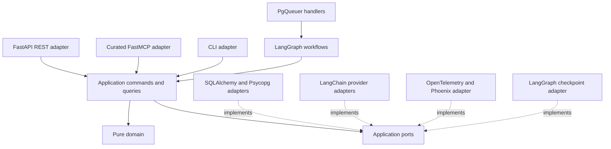
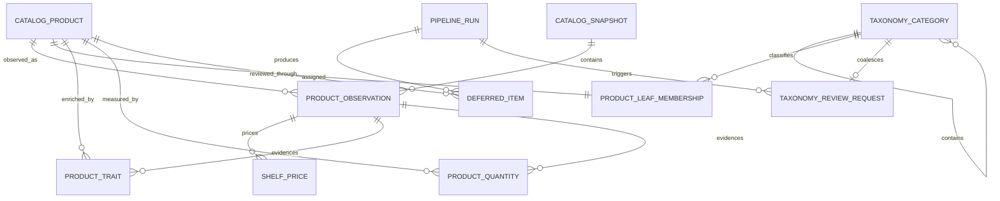
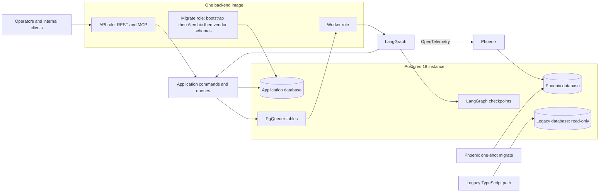

# Architecture Spine — Pricecomp 2026 Agent Workflow

## Design Paradigm

The backend is a **Hexagonal Modular Monolith organized into vertical domain-capability packages**. Each package owns pure domain rules, application commands and queries, ports, and adapter implementations. Dependencies point inward; domain code is framework-free.



## Invariants & Rules

### AD-1 — [ADOPTED] One Python backend

- **Binds:** all capabilities
- **Prevents:** TypeScript/Python service splits and duplicated domain ownership.
- **Rule:** One Python monolith owns agent workflow, REST, MCP, and data import; the frontend and read-only legacy path remain separate consumers.

### AD-2 — [ADOPTED] One staged ingest pipeline

- **Binds:** CAP-1, CAP-2
- **Prevents:** mode-specific agent paths and same-call category creation plus assignment.
- **Rule:** One ingest-selection primitive filters by source category or keyword; bulk is the empty filter and single is a filter of one. Selected products enter the same discover/create, assign, and extract stages; each stage has a separate prompt, result, and score. Because the modes are one code path, no separate three-mode equivalence acceptance is required.

### AD-3 — [ADOPTED] Substitutability tree

- **Binds:** CAP-3, CAP-5, CAP-8
- **Prevents:** graph semantics, SKU- or department-granularity defaults, and retailer taxonomy becoming the comparison primitive.
- **Rule:** Consumer substitutability is defined by a prose rubric plus few-shot same/not-same pairs, never by embedding clusters or price comparability. Taxonomy is one rooted parent-child tree with no self-parenting or cycles; comparison-eligible products have exactly one active membership to a leaf, enforced by database uniqueness and command validation, while unassigned/deferred products are explicitly ineligible. Under AD-16's single-writer runtime no taxonomy-wide compare-and-set topology revision is required. Facets filter within leaves, parents widen comparison only when the ancestor declares a compatible preferred unit, and import/source categories filter ingest only.

### AD-4 — [ADOPTED] Evidence and quantity integrity

- **Binds:** CAP-4, CAP-5
- **Prevents:** fabricated traits, quantities, conversions, and normalized prices.
- **Rule:** Extraction tries `unit`, then `price_text`, then product name; high-confidence deterministic success skips the LLM, which handles only residual, low-confidence, or empty cases. Every accepted non-null trait and quantity, deterministic or inferred, carries evidence bound to a catalog observation: source field, verbatim span, SHA-256 hash of that field's text at extraction time, and extractor/prompt version. Quantity kind distinguishes `net_content`, `item_count`, and `price_basis`. Selection precedence is deterministic `price_basis` when the source states a unit price and no fixed package is required, then deterministic `net_content`/`item_count`, then inferred equivalents; conflicts defer. Compare leaves require `preferred_comparable_unit` and may declare `secondary_comparable_units`. Parent widening returns one result set only when the ancestor declares a preferred unit compatible with descendant leaves; otherwise it returns a typed not-comparable result rather than inventing mixed-dimension rankings. Shelf price has kind (`regular`, `promo`, `per_unit`) and at most one current effective row per kind; selection is deterministic and mixed-currency queries fail closed. Normalized comparable price is **derived on read** from the current shelf-price and quantity revisions and always reported with currency and comparable unit. No normalized-price cache lives on quantity rows and no indexed comparison projection exists in MVP.

### AD-5 — [ADOPTED] Search-backed category context

- **Binds:** CAP-6, capability surface O1
- **Prevents:** full taxonomy or parent-subtree prompt dumps and protocol-owned domain logic.
- **Rule:** Agents obtain category context through search over the shared command layer. Curated MCP tools are the first adapter; no adapter may bypass commands.

### AD-6 — [ADOPTED] Owner-aware product merge

- **Binds:** CAP-1, CAP-7
- **Prevents:** re-import erasing prior validated LLM-owned values.
- **Rule:** Durable source identity is `(source_namespace, source_product_id, optional source_variant_id)` with `UNIQUE NULLS NOT DISTINCT` uniqueness; name and raw/canonical URLs are mutable facts. Each adapter owns a versioned normalization policy; missing or colliding stable IDs defer/fail explicitly and never fall back silently to presentation fields. Source-namespace ownership and identity-policy upgrades require an explicit migration/alias map; silent identity changes are forbidden. Each input belongs to an immutable catalog snapshot identified by source-observed time (UTC-interpreted), checksum, and adapter version. Ingest replaces imported facts for the products it observes and touches nothing else: MVP asserts no snapshot completeness, performs no absence-driven deactivation, and imposes no replay-ordering equality checks. Product upsert cannot write enrichment state — this is the D6 invariant and carries a dedicated regression test.

### AD-7 — [ADOPTED] Eager categories with hygiene

- **Binds:** CAP-3, CAP-8
- **Prevents:** provisional category lifecycle and unreconciled taxonomy fragmentation.
- **Rule:** Assignment searches existing categories and their membership before creating a real category when none fits. The taxonomy command surface must support merge, rename, edit, reparent, reassign, flag, and coherence repair; one post-bulk hygiene pass over the categories that run touched demonstrates merge, reassign, and coherence repair. Periodic scheduled hygiene is deferred. No draft category state exists and no merge occurs silently from name similarity alone.

### AD-8 — [ADOPTED] Non-blocking domain review

- **Binds:** CAP-4, CAP-5, CAP-8, CAP-9
- **Prevents:** pipeline waits and vendor annotation queues owning domain actions.
- **Rule:** Postgres `deferred_items` stores product reference, stage, reason code, attempts, immutable payload snapshot, trace ID/deep link, and status for unknown, defer, and low-confidence outcomes. A first-party **read-only** UI lists and inspects those rows and links out to the Phoenix trace; re-drive is a CLI command invoking the same application command handler. Reviewer domain writes (leaf reassign, trait edit, evidence accept/reject), leases, expected-revision rejection, and reviewed-override semantics are deferred — the review surface exists in MVP to show *where* the agent fails, not to act on it in-app. Phoenix annotations remain trace labels and golden-set inputs.

### AD-9 — [ADOPTED] Phoenix observability and evaluation

- **Binds:** CAP-10, observability and evaluation
- **Prevents:** vendor SDK coupling in domain, duplicate trace stores, custom run UI, and double-counted cost.
- **Rule:** Self-hosted Phoenix 19.11.1 under ELv2 is the sole trace, dataset, experiment, and run UI, using a dedicated PostgreSQL database; Arize AX, paid tiers, and exposing Phoenix as a third-party managed feature are excluded. Raw traces default to 30-day retention from first startup, Phoenix product telemetry is disabled, and versioned datasets/experiments persist independently. E1 measures golden assignment accuracy, E2 scores each stage, E3 computes total stage cost divided by all selected items including defer/failure, and E5 compares model/context configurations. Infrastructure aggregates only leaf LLM spans, verifies required usage/provider/model attributes and price-pattern matching, and reconciles estimated cost with provider billing for every introduced model.

### AD-10 — [ADOPTED] Hexagonal vertical packages

- **Binds:** all capabilities and bakeoff seams
- **Prevents:** framework-owned domain rules and adapter-specific use cases.
- **Rule:** Domain packages import no FastAPI, Pydantic, SQLAlchemy, LangGraph, LangChain, PgQueuer, Phoenix, or OpenTelemetry; application code coordinates ports; external technologies remain adapters.

### AD-11 — [ADOPTED] Pure domain operations

- **Binds:** deterministic domain kernel
- **Prevents:** hidden I/O and nondeterministic domain decisions.
- **Rule:** Domain operations receive facts and return new state, rejection, and/or unpublished domain events. Transactions, repositories, clocks, IDs, telemetry, and publication are application or adapter responsibilities.

### AD-12 — [ADOPTED] Telemetry port ownership

- **Binds:** all instrumented commands and workflows
- **Prevents:** OpenTelemetry types becoming domain or application contracts.
- **Rule:** Domain/application own a thin telemetry port; OpenTelemetry API/SDK, `opentelemetry-exporter-otlp-proto-http`, OpenInference instrumentors, and Phoenix integration live in adapters. The versioned `pricecomp.telemetry.v1` convention requires `pricecomp.run.id`, `pricecomp.stage.execution_id`, `pricecomp.stage.attempt_id`, `pricecomp.item.id`, `pricecomp.category.id`, immutable prompt/workflow/supply/evaluator versions, `llm.provider`, resolved model, and token usage; native OpenInference values win where both conventions exist. Parent spans carry run/stage-execution scope, leaf LLM spans represent one provider call, batched calls attach child/item spans or links each carrying `pricecomp.item.id`, and job envelopes propagate W3C trace context. Contract tests prove Phoenix joins E1/E2/E3/E5 without parent-token double counting.

### AD-13 — [ADOPTED] Split durable state ownership

- **Binds:** CAP-1, CAP-3, CAP-4, CAP-5, CAP-7, CAP-9
- **Prevents:** multiple modules mutating one business row and import reaching agent-owned state.
- **Rule:** Catalog owns source identity, immutable observations, imported facts, and shelf-price revisions behind generic source adapters; taxonomy owns the tree, aliases/tombstones, membership, trait/facet definitions, and comparable-unit policy; enrichment owns cited trait and quantity revisions; review owns deferred items and re-drive; pipeline owns run/stage coordination; comparison owns only derive-on-read queries and holds no state of its own. Every mutable concept has one command owner. Comparison reads run inside one repeatable database snapshot, never as independently timed owner reads.

### AD-14 — [ADOPTED] Command-only mutation

- **Binds:** CAP-2, CAP-7, CAP-8, CAP-9, CAP-10
- **Prevents:** persistence behavior varying by inbound adapter, agent, workflow, or bakeoff arm.
- **Rule:** Every business operation enters one application command handler, invokes domain validation, and commits all required owner and idempotency writes in one Unit of Work; job enqueue follows the commit per AD-22. Adapters may not compose several mutating commands to approximate one atomic operation. REST, MCP, CLI, agents, LangGraph nodes, and PgQueuer handlers never access SQL or repositories directly.

### AD-15 — [ADOPTED] Fresh-rebuild cutover

- **Binds:** CAP-1, CAP-7, CAP-10, migration
- **Prevents:** legacy taxonomy and attribute semantics contaminating the rebuild.
- **Rule:** Cutover moves legacy code, provisions new databases, and replays one immutable source manifest through the Python importer without legacy AI-derived state. Legacy stays read-only and the frontend stays on the legacy API during rebuild; no flat-taxonomy compatibility layer is added. Because all new-system state is reproducible by re-import, recovery is re-import: no freeze/restore drill, reconciliation gate ceremony, observation window, or timed routing-rollback rehearsal is required. Retire legacy once CAP-1–CAP-10 acceptance and the eval reports are accepted.

### AD-16 — [ADOPTED] API and worker process roles

- **Binds:** CAP-1, CAP-2, CAP-8, CAP-9, CAP-10
- **Prevents:** long-running work coupling API availability to execution and unequal resumability across experiments.
- **Rule:** One package and image run separate API and worker roles. API, MCP, and CLI submit commands or durable jobs; the worker executes bulk, filtered, single-item, hygiene, re-drive, and cleanup work. No Redis or external workflow runtime is required. **MVP runs a single worker and assumes a single operator** — this single-writer premise is what lets AD-3, AD-17, AD-21, and AD-22 omit compare-and-set topology revisions, generation watermarks, leases, and fencing tokens. Running more than one concurrent writer reopens those invariants.

  The premise is **mechanically enforced, not documented**: a worker acquires a PostgreSQL session-level advisory lock on startup, scoped to the application database, and exits with a distinct non-zero status and an explicit log line if the lock is already held. A second worker — deliberate, or accidental via a rolling deploy or a two-replica default — therefore fails at boot rather than silently corrupting taxonomy topology and poisoning eval baselines. The guard is lifted only together with the deferred concurrency machinery. It does not apply to bakeoff candidates, which hold separate databases per AD-20 and are single-writer within their own scope.

### AD-17 — [ADOPTED] Coalesced taxonomy review requests

- **Binds:** CAP-8
- **Prevents:** blocking category-wide checks and duplicate bulk review jobs.
- **Rule:** Assignment performs immediate structural and per-product semantic checks, then upserts one row unique per stable category scope and unions bounded trigger facts. Reassign/reparent/merge dirties old and new leaves, affected ancestry, moved subtrees, and stable source/target tombstone scopes without cascading pending work away. The post-bulk hygiene pass claims and clears those rows; under AD-16's single-writer runtime no generation watermark or fencing token is required.

### AD-18 — [ADOPTED] Current state without an event journal

- **Binds:** CAP-8, taxonomy hygiene and observability
- **Prevents:** duplicated trace payloads and generic event-consumer machinery.
- **Rule:** Current owner tables are authoritative; the durable taxonomy review request stores concise trigger facts and Phoenix references. No domain-event outbox or journal is built for taxonomy review.

### AD-19 — [ADOPTED] LangGraph workflow orchestration

- **Binds:** CAP-1, CAP-2, CAP-10
- **Prevents:** premature framework-neutral abstractions and graph state becoming a second business database.
- **Rule:** LangGraph directly owns MVP workflow orchestration. Workflow and product-supply candidates are separate graphs or configurations; graph state is orchestration-only and all business mutation invokes application commands.

### AD-20 — [ADOPTED] Controlled workflow bakeoffs

- **Binds:** CAP-10, O4, O5, P2, P3, P4, P9, P10
- **Prevents:** framework differences or duplicated business behavior confounding experiments.
- **Rule:** Candidate workflow and supply shapes run inside LangGraph against identical datasets, ingest slices, commands, models/prompts where controlled, instrumentation, eval definitions, and durability. Mutable state is isolated by cloning one immutable Postgres baseline—containing frozen catalog observations, taxonomy/config versions, and checksum identity—into a disposable database per candidate. Candidates never share a live mutable owner database. Cleanup deletes candidate databases. A test must prove no candidate can observe another candidate's writes. MVP arms are O4 and O5 for control flow and P2 and P4 for supply, a 2×2 requiring no embedding baseline. No winner is selected before golden assignment accuracy, per-stage scores, average cost per item, speed, and inspectability results exist.

### AD-21 — [ADOPTED] Split scheduling and checkpoint durability

- **Binds:** CAP-1, CAP-8, CAP-9, worker runtime
- **Prevents:** checkpoints acting as a scheduler and duplicated stage payload stores.
- **Rule:** Application Postgres records own work scheduling, reporting, and overall status. One immutable ingest-selection manifest groups candidate runs; each `pipeline_run_id` identifies one workflow/supply candidate and survives infrastructure retry. Each stage execution gets a `stage_execution_id`; each new provider invocation under it gets a `stage_attempt_id`. Before one-time command application, the stage execution durably stores the validated AD-34 outcome, request fingerprint, and config versions in application Postgres; Phoenix/provider IDs are supplemental provenance only and must not be the sole replay source. Replay reapplies that stored outcome rather than silently replacing it with a new call — this is what keeps cost and eval numbers honest across retries. LangGraph `AsyncPostgresSaver` uses `pipeline_run_id` as `thread_id`, a versioned workflow as checkpoint namespace, strict MessagePack allowlisting, and orchestration state only. Attempt-level fencing is unnecessary under AD-16's single worker.

### AD-22 — [ADOPTED] PgQueuer dispatch

- **Binds:** API/worker runtime and all durable launch paths
- **Prevents:** custom lease/retry infrastructure, dual-write job loss, and a second workflow engine.
- **Rule:** PgQueuer dispatches pipeline, re-drive, maintenance, and cleanup tasks. Enqueue happens **after** the triggering transaction commits; handlers are idempotent so a lost enqueue is recovered by re-driving from the owner row and a duplicated enqueue is a no-op. No transaction-joining producer bridge is built. Application work states are `pending`, `running`, `retry_wait`, `completed`, `failed`, or `cancelled`. A central versioned retry policy defaults transient infrastructure failure to five exponential full-jitter attempts capped at 15 minutes; deterministic invalid/defer never infrastructure-retries. Exhausted work remains inspectable/requeueable. Handlers tolerate replay and invoke LangGraph or commands rather than persistence.

### AD-23 — [ADOPTED] SQLAlchemy persistence adapters

- **Binds:** all state owners and dispatch transactions
- **Prevents:** implicit cross-module writes, dual commits, and ORM-coupled domain models.
- **Rule:** SQLAlchemy 2 async repositories and an application Unit of Work use Psycopg 3; Alembic owns application-schema migrations and never vendor tables. Persistence models map explicitly to pure domain objects, and Pydantic DTOs are neither ORM nor domain entities. Every authoritative table declares natural/current uniqueness, monotonic revision, optimistic compare-and-set behavior, and explicit supersession/history; database constraints enforce cardinalities that can be expressed locally.

### AD-24 — [ADOPTED] Co-hosted REST and curated MCP

- **Binds:** CAP-1, CAP-6, CAP-9, O1
- **Prevents:** REST-shaped tool bloat, duplicated behavior, and a second service boundary.
- **Rule:** One API process hosts FastAPI REST and a stateless FastMCP Streamable-HTTP ASGI app created with `http_app(path=\"/\", stateless_http=True)` and mounted at `/mcp`; FastAPI combines the MCP and application lifespans and strict trusted-host/origin settings apply whenever network-reachable. Both adapters use the same commands, queries, result/error contracts, idempotency semantics, and telemetry; MCP tools are curated rather than generated from OpenAPI. Because both are thin adapters over one command layer, a single lifespan-backed initialize/list/call smoke test fixes the mount behavior; no REST↔MCP equivalence suite is built.

### AD-25 — [ADOPTED] LangChain provider adapters

- **Binds:** CAP-2, CAP-6, CAP-10
- **Prevents:** provider SDK differences and hidden defaults confounding experiments.
- **Rule:** The application LLM port has LangChain chat-model adapters for exactly two providers in MVP (OpenAI and Anthropic); a third is added only when E5 needs a model family neither covers. Workflows use no LangChain agents, memory, persistence, or domain types. Immutable effective run configuration records provider, resolved model, structured-output method/schema/strictness, sampling, output limit, timeout, retry owner/count/backoff, streaming mode, and provider options; prompt, rubric, workflow, supply strategy, evaluator, trait schema, and conversion registry carry immutable content/version identities plus optional aliases.

### AD-26 — [ADOPTED] UUIDv7 application identities

- **Binds:** all application entities, commands, APIs, and runs
- **Prevents:** mixed ID types, random-UUID index fragmentation, and poor PostgreSQL B-tree locality on high-insert tables.
- **Rule:** Application-generated UUIDv7 is every application-owned entity's primary and public identity. Time ordering is acceptable because current application objects are non-privacy-sensitive; revisit UUIDv4 if a future entity class must not leak creation order or volume signals through its public ID. External `SourceIdentity` is a typed uniqueness key, not a second application primary-key type. PgQueuer, LangGraph, and Phoenix identifiers stay opaque adapter data and map explicitly to application run/attempt IDs.

### AD-27 — [ADOPTED] Python and uv toolchain

- **Binds:** Python build, test, dependency, and runtime environments
- **Prevents:** multiple Python package managers and Yarn wrappers around Python tooling.
- **Rule:** The monolith targets non-free-threaded CPython 3.14.6 and uv 0.12.1 with committed `pyproject.toml` and `uv.lock`; Linux CI against PostgreSQL 18.4 is compatibility authority. LangGraph Server/CLI extras and application Pydantic V1 models are excluded. Yarn remains only for frontend and read-only legacy TypeScript components. A reversible first bootstrap change relocates legacy code, fixes its paths/scripts, and updates path-scoped workspace rules and root documentation before Python implementation begins.

### AD-28 — [ADOPTED] Permanent backend and legacy paths

- **Binds:** repository structure and cutover
- **Prevents:** temporary versioned backend names and permanent technology-suffixed paths.
- **Rule:** `/backend` becomes the Python monolith root at rebuild start; the current TypeScript backend and data importer move under `/legacy`; `/frontend` remains the frontend root.

### AD-29 — [ADOPTED] Portable process-role topology

- **Binds:** local, CI, and production environments
- **Prevents:** environment-specific runtime shapes and shared application/Phoenix persistence.
- **Rule:** One backend image exposes `api`, `worker`, and `migrate` commands. Devcontainer and CI use the same commands and PostgreSQL 18.4 image, mounting its durable volume at `/var/lib/postgresql`; Compose also runs Phoenix and the relocated legacy API during transition. Application, Phoenix, and frozen legacy use separate databases/roles; PgQueuer and LangGraph tables share the application database but remain vendor-owned. One-shot order is database/role bootstrap, Alembic, PgQueuer install/upgrade, LangGraph checkpointer setup, Phoenix migration, then service readiness. Public production is prohibited until the security initiative; later deployment must preserve the role contract.

### AD-30 — [ADOPTED] Cross-package data conventions

- **Binds:** all persisted state, APIs, commands, and jobs
- **Prevents:** incompatible identity, time, numeric, enum, idempotency, and ownership semantics.
- **Rule:** Use UUIDv7 application IDs, UTC `timestamptz` and RFC 3339 wire timestamps, ISO 4217 currency, a versioned canonical unit registry, positive Decimal/`NUMERIC(24,12)` calculation values with round-half-even only at declared presentation boundaries, string-encoded JSON decimals, and lowercase `snake_case` enums. For fixed content/count, normalized price is `shelf_price_amount / selected_quantity_in_preferred_unit`; a source `price_basis` converts its stated denominator directly and never invents package content. Results always include currency and comparable unit. Application idempotency is scoped by `(command_type, caller, key)`, binds a canonical payload hash, atomically records in-progress/terminal result with business effects, rejects changed payloads, and outlives queue/checkpoint replay. Owner tables are authoritative; vendor tables are adapter-private.

### AD-31 — [ADOPTED] Verification boundaries

- **Binds:** all capability verification
- **Prevents:** framework-dependent domain tests, adapter drift, and quality metrics masquerading as unit assertions.
- **Rule:** Pure-domain tests require no framework or database; persistence, Unit of Work, source replay, queue, checkpoint, and migration adapters test against disposable PostgreSQL 18.4 on Linux CI. Crash-window and multi-writer concurrency suites are out of MVP under AD-16's single-writer premise; handler idempotency and re-drive are tested instead. One MCP mount smoke test plus REST contract tests cover the adapter surface. Immutable eval manifests freeze source/taxonomy/golden-label/config/evaluator versions, denominator and failure/defer treatment; stage quality, cost, and speed run as paired Phoenix dataset experiments. The D6 non-wipe regression test is mandatory.

### AD-32 — [ADOPTED] Internal exposure boundary

- **Binds:** REST, MCP, CLI, deployment
- **Prevents:** unauthenticated mutation surfaces being exposed publicly while security is outside initiative scope.
- **Rule:** API and MCP remain local or internal until a security/auth initiative supplies the external boundary; no deployment exposes unauthenticated MCP mutations publicly by default.

### AD-33 — [ADOPTED] Kill-pile exclusion

- **Binds:** all capabilities and experiments
- **Prevents:** rejected options returning as scaffolding, fallbacks, or hidden implementation shortcuts.
- **Rule:** No production or experiment unit may implement or lay groundwork for an option listed in `kill-pile.md`; architecture and code review must treat that companion as a binding negative contract.

### AD-34 — [ADOPTED] Versioned shared contracts

- **Binds:** catalog, taxonomy, enrichment, review, pipeline, comparison, REST, MCP, jobs, and evals
- **Prevents:** independently valid packages disagreeing on values, stage outcomes, errors, or replay meaning.
- **Rule:** A framework-free `contracts/v1` package owns `SourceIdentity`, `CatalogSnapshotRef`, `ProductSnapshot`, `Money`, `EvidenceRef`, typed trait/quantity values, command request/result schemas, stable domain error codes, and each stage input/outcome. `EvidenceRef` uses NFC-normalized field text, UTF-8 byte offsets, and SHA-256 over the exact field bytes. Stage outcomes use `success`, `unknown`, `defer`, `invalid`, or `retryable_failure`, distinguish proposals from committed command receipts, carry prerequisite/produced revisions and immutable config IDs, and are the sole evaluator input. Taxonomy mutating commands carry a taxonomy-wide monotonic topology revision with compare-and-set; R/D/A workflow variants may change who produces or applies an outcome, never its schema or commit semantics.

### AD-35 — [RETIRED 2026-08-01] Revisioned pgvector retrieval

- **Status:** retired by the MVP scope reduction. Embeddings leave MVP entirely: no `retrieval` package, no pgvector extension, no embedding-similarity ingest filter, and no embedding-dependent supply arms (P3/P9/P10) or C4 category shortlist.
- **Revisit when:** C2 search shows a measured context-recall or cost ceiling on the eval harness. The retired rule stands as the design to reinstate — revisioned embeddings keyed by `(observation revision, model/version, preprocessing version)`, versioned distance metric and index type, one snapshot shared by CAP-1 filters and P-strategy candidates, generated once into the AD-20 baseline and read-only in cloned candidate databases.

## Stack

| Name | Version |
| --- | --- |
| Python | 3.14.6 |
| uv | 0.12.1 |
| PostgreSQL | 18.4 |
| LangGraph | 1.2.10 |
| langgraph-checkpoint-postgres | 3.1.1 |
| PgQueuer | 1.3.2 |
| SQLAlchemy `[asyncio]` | 2.0.51 |
| Alembic | 1.18.5 |
| Psycopg `[binary]` | 3.3.4 |
| psycopg-pool | 3.3.1 |
| FastAPI | 0.141.1 |
| FastMCP | 3.4.5 |
| Uvicorn | 0.52.0 |
| langchain-core | 1.5.3 |
| langchain-openai | 1.4.1 |
| langchain-anthropic | 1.5.3 |
| Pydantic | 2.13.4 |
| OpenTelemetry API/SDK | 1.44.0 |
| opentelemetry-exporter-otlp-proto-http | 1.44.0 |
| OpenInference LangChain instrumentation | 0.1.68 |
| Phoenix | 19.11.1 |
| Phoenix container | `arizephoenix/phoenix:version-19.11.1` |

## Structural Seed

```text
backend/
  pyproject.toml
  uv.lock
  src/pricecomp/
    contracts/     # framework-free v1 values, stage envelopes, errors
    catalog/       # source identity, imported facts, shelf price
    taxonomy/      # category tree, membership, hygiene
    enrichment/    # cited traits, quantities, normalized values
    review/        # deferred items, read-only surface, CLI re-drive
    pipeline/      # runs, stages, LangGraph workflows
    comparison/    # derive-on-read comparison queries (no owned state)
    evaluation/    # Phoenix datasets, evaluators, experiment tasks
    platform/      # REST, MCP, CLI, dispatch, persistence, LLM, telemetry adapters
  migrations/      # Alembic application-schema migrations
  tests/
    domain/
    integration/
    contract/
    evals/
frontend/
legacy/
  backend/
  data-importer/
```





## Capability → Architecture Map

| Capability | Lives in | Governed by |
| --- | --- | --- |
| CAP-1 — unified ingest modes | catalog, pipeline, API/worker adapters | AD-1, AD-2, AD-13–AD-16, AD-22 |
| CAP-2 — separately scored stages | pipeline workflows and evals | AD-2, AD-14, AD-19–AD-22, AD-25, AD-34 |
| CAP-3 — substitutability taxonomy | taxonomy | AD-3, AD-7, AD-13 |
| CAP-4 — cited traits | enrichment, review | AD-4, AD-8, AD-13 |
| CAP-5 — comparable quantities and prices | enrichment, taxonomy, comparison | AD-3, AD-4, AD-13, AD-30 |
| CAP-6 — searched category context | taxonomy queries, curated MCP, LLM adapter | AD-5, AD-24, AD-25 |
| CAP-7 — non-destructive re-import | catalog and enrichment commands | AD-6, AD-13–AD-15, AD-23 |
| CAP-8 — category creation and hygiene | taxonomy, pipeline worker | AD-7, AD-17–AD-22 |
| CAP-9 — asynchronous human review | review, first-party read-only UI, CLI re-drive | AD-8, AD-13, AD-14, AD-16, AD-22, AD-24 |
| CAP-10 — controlled bakeoffs | pipeline graphs, baseline database, evals, Phoenix | AD-9, AD-19–AD-21, AD-25, AD-31 |

## Deferred

### Deferred by the 2026-08-01 MVP scope reduction

Each entry names the invariant text that was removed and the condition that reopens it. None of these are killed options; `kill-pile.md` remains the only negative contract.

- **Embeddings and the `retrieval` package (AD-35 retired):** reinstate when C2 search shows a measured context-recall or cost ceiling. Also gates P3/P9/P10 supply arms, the embedding-similarity ingest filter, and C4.
- **Indexed comparison projection (AD-4):** revision-linked rows, fail-closed serveability, same-UoW invalidation, and atomic generation switch return when derive-on-read comparison queries are measured too slow at the target catalog size.
- **Catalog snapshot completeness semantics (AD-6):** completeness attestation, absence-driven deactivation, replay-ordering equality, and legacy conformance proof return when a second source adapter or a source that genuinely delists products is onboarded.
- **Enrichment freshness cascade (AD-4):** carry-forward hash proofs and automatic ineligibility on observation advance return alongside multi-revision source drift.
- **Byte-offset / NFC evidence addressing (AD-4):** returns if evidence disputes or non-ASCII offset bugs actually appear; MVP evidence is field + verbatim span + field hash.
- **Concurrency machinery (AD-3, AD-17, AD-21, AD-22):** taxonomy topology compare-and-set, generation watermarks, leases/fencing tokens, and the transaction-joining PgQueuer producer return the moment more than one worker or writer runs concurrently. AD-16 records this premise explicitly.
- **Reviewer domain writes (AD-8):** in-app leaf reassign, trait edit, and evidence accept/reject return when the read-only queue proves worth acting on in-app rather than by CLI.
- **Third LLM provider (AD-25):** returns when E5 needs a model family the two adapters do not cover.
- **Periodic scheduled hygiene (AD-7, AD-17):** returns if post-bulk hygiene is shown to miss drift between runs.
- **Gated cutover ceremony (AD-15):** freeze/restore drill, reconciliation gates, observation window, and routing-rollback rehearsal return when the system holds data that cannot be recovered by re-import.
- **Crash-window and multi-writer test suites (AD-31):** return with the concurrency machinery above.

### Deferred by design

- **O4/O5 control-flow winner and P2/P4 supply winner:** revisit only after each candidate runs on the same eval set and ingest slice with shared quality, cost, speed, and inspectability metrics under AD-20 isolation.
- **O2 CLI-like agent surface:** revisit when O1 tool definitions cause measured token blowup; any candidate must expose precomputed aggregates, explicit empty states, and structured errors.
- **O3 Code Mode:** revisit when intermediate data demonstrably should not enter model context; any sandbox must call application APIs, never the database.
- **R1/R2/R5/R6 parse, D1/D2 persistence timing, and A2/A3 assignment timing:** variants may be evaluated only behind AD-34's fixed stage envelope, statuses, prerequisite revisions, and one-time command-application semantics; register each variant before graph implementation.
- **Model and prompt defaults:** select through E5 experiments; every run continues to pin model, provider, prompt, workflow, and supply-strategy IDs.
- **PgQueuer completion reliance:** before any dispatch-backed feature, prove enqueue-after-commit recovery, SIGKILL recovery with LangGraph resume, cancellation, trace propagation, and terminal disposition on a single worker; failure reopens queue selection. Multi-worker global concurrency proof moves with the deferred concurrency machinery.
- **First-party review lifecycle details:** before review schema/UI implementation, bind uniqueness/coalescing, transition table, retry/cancel rules, and re-drive target while preserving AD-8's read-only MVP surface.
- **Bootstrap acceptance manifest:** before the relocation unit merges, bind exact move paths, path-scoped rules, legacy data-path/Husky fixes, legacy build/test evidence, port assignments for legacy vs new API, and proof that no Python domain code mixes into the relocation.
- **Database role/schema privilege manifest:** before Compose bootstrap, bind database names, least-privilege roles, vendor schemas/search_path, grants, and that runtime credentials cannot create databases or run arbitrary migrations.
- **Lateral taxonomy edges:** revisit only if measured comparison failures show that tree plus facets and parent widening are insufficient.
- **Frontend review and category-browser details:** resolve before frontend migration; the cutover strategy and prohibition on a legacy flat-taxonomy compatibility layer are fixed by AD-15.
- **Queue/checkpoint maintenance thresholds:** before sustained ingest, set retention, orphan reconciliation, cleanup batches/timeouts, checkpoint deletion boundaries, autovacuum expectations, and storage alerts.
- **CI/release contract:** before CI implementation, bind lock verification, service graph, migration gate, image build/SBOM, artifact promotion, and clean-checkout smoke test using AD-29 role commands.
- **Configuration and secrets contract:** before shared deployment, inventory every role variable, secret source, validation/default, mounted catalog input, provider rate-limit policy, and log-redaction rule.
- **Backup/recovery contract:** before the first non-local data, define encrypted backup cadence/retention and restore drills for application, Phoenix, and legacy databases; declare RPO/RTO before cutover.
- **Operations contract:** before sustained ingest, define health/readiness, graceful drain, queue/run/database/Phoenix metrics, dashboards, alerts, migration-head checks, and runbook ownership.
- **Production provider, autoscaling quantities, connection pooler, and deployment IaC:** resolve before internal staging while preserving AD-16 and AD-29; public deployment remains prohibited by AD-32.
- **External authentication, authorization, and threat model:** resolve in a security initiative before public API or MCP exposure.
