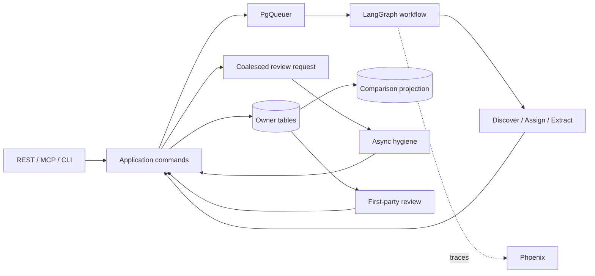

# Architecture diagrams — 2026 agent workflow

Pipeline sketch from MVP commitments only. LangGraph is selected; control-flow workflow shapes (O4/O5) and product supply (P\*) remain explore-under-eval.

```text
REST / curated MCP / CLI
  → shared application commands
  → PgQueuer job → LangGraph workflow (O4/O5 shapes under eval)
  → discover/create | assign | extract (I9)
  → category search (C2) + product supply P2/P3/P4/P9/P10 under eval
  → deterministic validators + evidence_span (I3); unknown→DLQ (H2)
  → owner-specific transactional writes; import cannot reach enrichment state (D6)
  → revision-linked comparison projection for indexed normalized-price reads
  → coalesced taxonomy_review_requests → async hygiene (M2/M5)
  → first-party non-blocking review (H1/H2)

Phoenix receives traces and runs E1/E2/E3/E5 experiments; current application tables remain authoritative.
```


