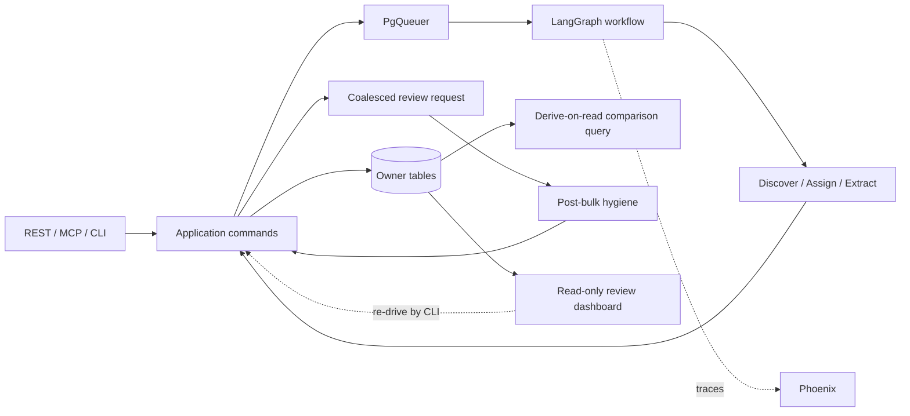

# Architecture diagrams — 2026 agent workflow

Pipeline sketch from MVP commitments only (post 2026-08-01 scope reduction). LangGraph is selected; control-flow workflow shapes (O4/O5) and product supply (P2/P4) remain explore-under-eval.

```text
REST / thin MCP / CLI
  → shared application commands
  → PgQueuer job (enqueued after commit, idempotent handler) → LangGraph workflow (O4/O5 shapes under eval)
  → discover/create | assign | extract (I9)
  → category search (C2) + product supply P2/P4 under eval
  → deterministic validators + evidence_span (I3); unknown→DLQ (H2)
  → owner-specific transactional writes; import cannot reach enrichment state (D6)
  → normalized comparable price derived on read from current shelf-price + quantity revisions
  → coalesced taxonomy review requests → post-bulk hygiene (M2/M5)
  → first-party non-blocking review: read-only dashboard (H1) + DLQ (H2) + CLI re-drive
```



Phoenix receives traces and runs E1/E2/E3/E5 experiments; current application tables remain authoritative.
