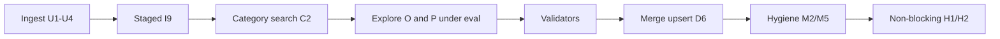

# Architecture diagrams — 2026 agent workflow

Pipeline sketch from MVP commitments only. Orchestration (O\*) and product supply (P\*) remain explore-under-eval.

```text
ingest (U1–U4, same pipeline)
  → staged prompts (I9): discover/create (I7 then N1) | assign | extract
  → category context via agent search (C2); mature adds embed shortlist (C4)
  → product context: EXPLORE (P2/P3/P4/P9/P10) under eval (E1/E2/E5)
  → orchestration: EXPLORE (O1–O5) under same eval harness
  → traits/units: evidence_span (I3) + validators; T1 deterministic-first; unknown→DLQ (H2)
  → persist: merge upsert (D6); write path EXPLORE D1 vs D2
  → taxonomy hygiene: M2 + M5 (incl. coherence); merge suggestions UI later (M6)
  → human: non-blocking only (H1/H2)
```


