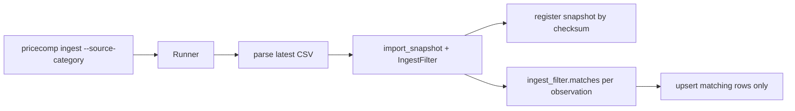

# Ingest filter (1.5)

## Goal

Make `pricecomp ingest --source-category "Milchprodukte"` work: same import path as today’s bulk ingest, but only upserting rows that match a filter. Empty filter stays bulk; a filter that happens to match one row is “single” — no mode branches, and no pin-by-id flag (use a distinctive `--keyword` when you want one row).

## Locked decisions

- **Filter is criteria, not a DB manifest.** Old BMAD ACs mentioned an “immutable ingest-selection manifest” table; the living roadmap demo and 4.5 (`pricecomp run --source-category …`) re-specify the filter on the CLI. No new table in 1.5.
- **Match rules**
  - `--source-category NEEDLE`: case-insensitive **substring** of `source_category` **or** case-insensitive **exact** match of `unified_category` (so `"Milchprodukte"` hits Migros’s long German department, and `"dairy"` hits the shared publisher label).
  - `--keyword NEEDLE`: case-insensitive substring of `name` or `name_de`.
  - Both set → AND. Neither set → match all (bulk).
- **Apply inside** [`import_snapshot`](backend/src/pricecomp/catalog/commands.py) so CLI, tests, and a future pipeline launcher share one path. Snapshot registration stays whole-file (checksum unchanged); the filter only narrows which observations upsert.
- **Observe-only** stays as today: non-matching / absent products are never deactivated. Zero matches → succeed with `upserted=0` and a warning log (don’t hard-fail on typos).



## Implementation

### 1. Domain filter type

Add [`backend/src/pricecomp/catalog/ingest_filter.py`](backend/src/pricecomp/catalog/ingest_filter.py):

- Frozen `IngestFilter(source_category: str | None, keyword: str | None)`
- `is_empty` / `matches(name=, name_de=, source_category=, unified_category=)` / `filter_observations(observations) -> list`
- Pure functions only — no I/O. This is what 4.5 will reuse (DB query will mirror the same predicate later).

### 2. Wire into import command

In [`backend/src/pricecomp/catalog/commands.py`](backend/src/pricecomp/catalog/commands.py):

- Add `ingest_filter: IngestFilter = IngestFilter()` on `ImportSnapshotRequest`
- After collision grouping, keep only observations where `ingest_filter.matches(...)`
- Extend `ImportSnapshotResult` with `matched_count` (matched before upsert) and `filtered_out_count` so the CLI can print useful numbers
- Still register/reuse the snapshot even when the filter drops everything

### 3. CLI + runner

- [`cli.py`](backend/src/pricecomp/platform/cli.py): add `--source-category` and `--keyword`; pass through to runner
- [`runner.py`](backend/src/pricecomp/platform/ingest/runner.py): accept `ingest_filter: IngestFilter`, put it on each `ImportSnapshotRequest`; include matched/filtered counts in `IngestRunSummary` / stdout
- Keep existing `--retailer` as “which CSV folders,” orthogonal to the product filter

### 4. Docs / roadmap

- Update ingest section in [`backend/README.md`](backend/README.md) with the new flags and the Milchprodukte example
- Check off **1.5** in [`docs/plans/roadmap.md`](docs/plans/roadmap.md)

### 5. Tests

- **Unit** [`backend/tests/domain/test_ingest_filter.py`](backend/tests/domain/test_ingest_filter.py): empty / substring / case / unified exact / keyword / AND / no match
- **Unit** extend [`test_import_snapshot.py`](backend/tests/domain/test_import_snapshot.py): filtered import upserts subset; seeded non-matching products untouched; empty filter unchanged behavior; filter-of-one uses same `import_snapshot` call
- **Integration** extend [`test_catalog_ingest.py`](backend/tests/integration/test_catalog_ingest.py) (or a small runner test): fixture CSV with a known category needle yields a proper subset count

No `if mode == "bulk"` branches anywhere — static review is enough for the old 1.6-UNIT-001 intent.

## Out of scope (explicit)

- Persisted filter/manifest table / `--selection-id`
- Pin-by-id (`--source-product-id`); “single” is a filter that matches one row
- Embedding similarity filter (deferred in scope doc)
- `pricecomp run` / ProductRepository `list_matching` (4.5) — only leave `IngestFilter` importable from `catalog`
- Indexes on category columns (not needed until DB-side filtering in 4.5)
- The unrelated `tmp/review.md` SQL/upsert tidy-ups

## Done when

```bash
pricecomp ingest --source-category "Milchprodukte" --retailer migros
# upserted ≈ rows whose source_category contains Milchprodukte; other products untouched
pricecomp ingest   # empty filter still imports latest CSV(s) in full
```
