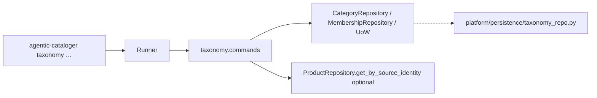

# Dev Plan: Taxonomy tree + leaf membership (2.1 + 2.3)

- **Date**: 2026-08-03
- **Author**: plan-task, nathanvogel
- **Status**: Done
- **Primary services**: `backend` (`agentic_cataloger.taxonomy`, `agentic_cataloger.platform`)
- **Related specs / ADRs**: [architecture.md § Taxonomy](../specs/architecture.md), [2026-scope.md](../specs/2026-scope.md), [roadmap.md](roadmap.md) items **2.1** / **2.3** (+ nullable `preferred_comparable_unit` note)

## 1. Problem

M0 put products in the DB. The MVP agent still has nowhere to put them: no substitutability tree, no product↔leaf link. M1 needs both as plain application commands (CLI-testable, no LLM) before discover/assign stages exist.

## 2. Goals and non-goals

**Goals**

- Persist a **rooted** substitutability category tree (no cycles, no self-parenting, no lateral/graph edges).
- Assign a product to **exactly one leaf**, enforced by DB uniqueness; re-assign **moves** the membership.
- Ship nullable `preferred_comparable_unit` on categories (store + show only; no validation).
- Expose CLI: `taxonomy create|reparent|show|assign`.
- Write the substitutability prose rubric + few-shot pairs as a spec the M2 agent will consume.

**Non-goals**

- Search-backed category context (**2.5**), hygiene merge/rename/coherence (**2.7**), comparable-unit validation (**2.2**).
- LLM / LangGraph / telemetry / deferred queue.
- Advisory lock (**1.3**), idempotency keys (**1.8**), REST/MCP surfaces.
- `secondary_comparable_units`, facets, draft/provisional category states.
- D6 regression suite (**1.7**) beyond the structural property that membership lives **off** `catalog_products` so ingest upsert cannot wipe it.

## 3. Success criteria

- Given a migrated DB, when I `taxonomy create` a root then children, `taxonomy show` prints a rooted tree with ids, names, and nullable units.
- When I reparent in a way that would cycle or self-parent, the command fails with a domain error (no partial write).
- When I create/reparent such that a category with memberships would stop being a leaf, the command fails until those products are moved.
- When I `taxonomy assign --product-id <uuid> --leaf <uuid>`, membership lands only if the target is a leaf; a second assign for the same product moves it to the new leaf.
- DB rejects a second membership row for the same product (UNIQUE on `product_id`).
- Re-running `agentic-cataloger ingest` does not delete or alter taxonomy membership rows (separate table; no catalog upsert touch).
- Artifact: `docs/specs/substitutability-rubric.md` with prose definition + ≥3 same / ≥3 not-same few-shot pairs (Swiss grocery examples fine).
- Validation: domain tests (fakes) + integration tests (migrated Postgres) + manual CLI smoke on a local DB.

## 4. Scope lock-in

```
SCOPE LOCK-IN (approved)
- Goal: Rooted substitutability taxonomy in Postgres + CLI to create/reparent/show
  categories and assign a product to exactly one leaf; nullable
  preferred_comparable_unit on categories; prose rubric + few-shot pairs as a
  doc for M2.
- In scope: 2.1 tree; 2.3 one-leaf membership + uniqueness; CLI
  taxonomy create|reparent|show|assign; migration(s); domain commands in
  agentic_cataloger.taxonomy; rubric markdown under docs/specs/.
- Out of scope: 2.5 search; 2.7 hygiene; 2.2 unit validation; LLM/agent/
  pipeline; advisory lock; FastAPI/MCP.
- Primary packages/services: backend (taxonomy, platform CLI/persistence, Alembic)
- Success criteria: as §3
- Re-assign semantics: move (upsert), not fail-until-unassign
```

## 5. Approach

Mirror the catalog hexagonal pattern: pure `taxonomy/` domain (models, errors, ports, commands) + `platform/persistence/taxonomy_repo.py` (raw psycopg SQL, not ORM) + CLI dispatch beside `ingest`.



**Sequence**

1. Alembic `003_taxonomy_tree` — tables + constraints.
2. Domain models/errors/ports/commands (create, reparent, show/list tree, assign).
3. Psycopg adapters + shared or taxonomy UoW (same connection style as catalog).
4. CLI wiring + README.
5. Rubric doc.
6. Domain + integration tests.

### 5.1 File inventory

**Create**

- `backend/migrations/versions/003_taxonomy_tree.py`
- `backend/src/agentic_cataloger/taxonomy/models.py` — `Category`, `Membership`, command results
- `backend/src/agentic_cataloger/taxonomy/errors.py` — cycle, self-parent, not-leaf, missing, non-leaf-has-members, etc.
- `backend/src/agentic_cataloger/taxonomy/ports.py` — `TaxonomyUnitOfWork`, category + membership repos
- `backend/src/agentic_cataloger/taxonomy/commands.py` — `create_category`, `reparent_category`, `show_taxonomy`, `assign_product_to_leaf`
- `backend/src/agentic_cataloger/taxonomy/tree.py` — pure helpers: would-cycle?, is-leaf?, ancestor walk (no I/O)
- `backend/src/agentic_cataloger/platform/persistence/taxonomy_repo.py`
- `backend/src/agentic_cataloger/platform/taxonomy/runner.py` — wire DB → commands (mirror `platform/ingest/runner.py`)
- `backend/tests/domain/test_taxonomy_boundaries.py` — clone catalog AST guard for `taxonomy/`
- `backend/tests/domain/test_taxonomy_tree.py` — cycle / leaf / move semantics with fakes
- `backend/tests/integration/test_taxonomy_tree.py` — migrate + CLI-shaped command path + UNIQUE
- `docs/specs/substitutability-rubric.md`

**Modify**

- `backend/src/agentic_cataloger/taxonomy/__init__.py` — package docstring
- `backend/src/agentic_cataloger/platform/cli.py` — `taxonomy` top-level command + help text
- `backend/README.md` — document `taxonomy` subcommands
- `docs/plans/roadmap.md` — mark **2.1** and **2.3** done when implementation lands (executor, not this planning commit)

**Delete:** none

### 5.2 Data / contract changes

**Tables** (prefix aligned with `catalog_*`):

```text
taxonomy_categories
  id UUID PK
  name TEXT NOT NULL
  parent_id UUID NULL REFERENCES taxonomy_categories(id)
  preferred_comparable_unit TEXT NULL
  created_at / updated_at TIMESTAMPTZ
  CHECK (parent_id IS DISTINCT FROM id)          -- no self-parent
  partial UNIQUE (1) WHERE parent_id IS NULL     -- exactly one root once created
  -- no UNIQUE(name): agent may create similarly named leaves under different parents later;
  -- disambiguate in CLI by UUID

taxonomy_memberships
  product_id UUID PK REFERENCES catalog_products(id)   -- one leaf per product
  category_id UUID NOT NULL REFERENCES taxonomy_categories(id)
  assigned_at TIMESTAMPTZ NOT NULL DEFAULT now()
  -- leaf-only enforced in commands (DB cannot cheaply express "no children")
```

**API:** none (CLI only).

**Env vars / flags:** none new (`DATABASE_URL` as today).

**Downgrade:** drop memberships then categories.

### 5.3 External touch points

- Reads `catalog_products` for assign (FK + optional source-identity resolve). Does not change ingest.
- No Phoenix / LangGraph / frontend.

## 6. Pitfalls and mitigations

| Pitfall | Impact | Mitigation | Owner |
| --- | --- | --- | --- |
| Confusing import `source_category` with substitutability categories | Wrong assign targets / bad agent prompts later | Keep retailer fields on `catalog_products` only; taxonomy tables never store import labels; README callout | executor |
| Membership on `catalog_products` columns | Re-import wipes enrichment (legacy D6 bug) | Separate `taxonomy_memberships`; ingest upsert list unchanged | executor |
| Leaf gains children while still holding products | Orphan “membership on non-leaf” | Reject create/reparent that would make a membered node non-leaf | executor |
| Cycle only checked in app, bypassed by raw SQL | Corrupt tree | CHECK self-parent + domain ancestor walk; single-operator prototype accepts no DB cycle trigger (accepted risk) | plan |
| Ambiguous `--leaf` by name | Wrong assign | CLI identifies categories by UUID; `show` prints ids | executor |
| Boundary leak: taxonomy imports psycopg | Hex broken | `test_taxonomy_boundaries.py` AST guard | executor |
| Root uniqueness race | Two roots | Partial unique index `WHERE parent_id IS NULL` | executor |

**Blast-radius ripples (checked)**

- Catalog ingest / `catalog_repo` upsert: **no change** (include now as non-goal / regression: membership untouched).
- Comparison / enrichment / pipeline packages: still seeds — **no consumers** yet.
- CLI help + README: **in scope**.
- Roadmap checkbox: update when code ships.

Accepted risks:

- No DB-level cycle trigger / recursive constraint (app + self-parent CHECK only) until concurrent writers exist.
- No advisory lock on taxonomy mutations (cut **1.3**).
- Leaf-ness is derived (no children), not a stored flag — race under concurrency is out of MVP threat model.

## 7. Technical decisions

### Decision: Table naming `taxonomy_*`

- **Choice**: `taxonomy_categories`, `taxonomy_memberships`
- **Options considered**: A) `categories` / `product_category_membership`, B) `taxonomy_*`, C) columns on `catalog_products`
- **Why**: Matches `catalog_*` prefix; avoids generic `categories` clash with retailer source categories in docs/SQL.
- **Rejected because**: A — easy to confuse with import categories; C — D6 wipe risk and mixes owners.

### Decision: One root via NULL `parent_id` + partial unique

- **Choice**: At most one row with `parent_id IS NULL`; first `create` without `--parent` is the root; further root creates fail.
- **Options considered**: A) sentinel root inserted in migration, B) partial unique + CLI-created root, C) multiple roots / forest
- **Why**: Architecture says one rooted tree; no magic seed row to rename later.
- **Rejected because**: A — opaque migrate side effect; C — contradicts “one rooted tree”.

### Decision: Leaf = no children; assign rejects non-leaves

- **Choice**: Derived leaf; membership commands require target has zero children; structural cmds refuse to demote a membered node to non-leaf.
- **Options considered**: A) derived leaf, B) explicit `is_leaf` column, C) allow membership on any node
- **Why**: YAGNI; matches “leaves = finest granularity”.
- **Rejected because**: B — two sources of truth; C — breaks compare-at-leaf invariant.

### Decision: Re-assign moves (UPSERT)

- **Choice**: `ON CONFLICT (product_id) DO UPDATE SET category_id = …`
- **Options considered**: A) move, B) fail until unassign
- **Why**: Approved in planning; keeps “exactly one leaf” without an unassign command.
- **Rejected because**: B — extra CLI surface for MVP.

### Decision: CLI product identity

- **Choice**: Required `--product-id` (UUID). Optional sugar: `--namespace` + `--source-product-id` `[--variant]` resolved via catalog `ProductRepository` (exactly one of the two styles).
- **Options considered**: A) UUID only, B) source identity only, C) both
- **Why**: FK is UUID; operators debugging CSV still want source identity.
- **Rejected because**: A alone is painful after ingest; B alone is awkward with nullable variants.

### Decision: Cycle detection in domain, not trigger

- **Choice**: Load ancestors (or parent chain) in the command; reject if new parent is self or descendant.
- **Options considered**: A) domain walk, B) recursive CTE BEFORE trigger, C) ltree/closure table
- **Why**: Prototype, single writer; keep migration thin.
- **Rejected because**: B/C — premature until concurrent mutation or huge trees hurt.

### Decision: Rubric as `docs/specs/substitutability-rubric.md`

- **Choice**: Standalone spec, linked from roadmap/architecture later if needed
- **Options considered**: A) under `docs/specs/`, B) embed in prompts package now, C) skip until M2
- **Why**: 2.3 asks for the rubric written now; M2 prompts can load the file or paraphrase.
- **Rejected because**: B — no prompt package yet; C — contradicts 2.3.

## 8. Testing strategy

Tag = product decision protected.

| Tag | Test | Where |
| --- | --- | --- |
| **core** | create root + child; show returns parent/child links | domain + integration |
| **core** | assign product to leaf; membership readable | domain + integration |
| **core** | second assign moves to new leaf (one row remains) | domain + integration |
| **boundary** | assign to non-leaf rejected | domain (+ integration) |
| **boundary** | create child under membered leaf rejected | domain (+ integration) |
| **boundary** | reparent that would cycle rejected | domain |
| **invariant** | UNIQUE `product_id` — raw second INSERT raises | integration |
| **invariant** | taxonomy package has no adapter imports | domain AST |
| **invariant** | after assign, catalog ingest upsert does not remove membership | integration (light) |

No eval / LLM tests.

Manual: migrate → create root/children → show → assign one real ingested product → show/assign again to another leaf → re-ingest same CSV → membership still present.

## 9. Observability

- Structured logs on command success/reject (category id, product id, reason) via stdlib logging — same as ingest.
- No metrics/traces in this task (telemetry is **4.3**).

## 10. Rollout and rollback

- Dev/local only. Run `agentic-cataloger migrate` after pull.
- No backfill (empty tree).
- Rollback: `alembic downgrade` drops memberships then categories; no catalog data loss.
- Revert commit safe if migrate not applied in shared envs (there are none yet beyond local).

## 11. Open questions

- None blocking. Rubric example content is executor-authored (Swiss grocery same/not-same pairs); product owner can edit the doc later without a schema change.

## 12. Hand-off block

```
HAND-OFF PROMPT
- Plan: docs/plans/20260803-backend-taxonomy-tree.md
- Primary packages/services: backend (agentic_cataloger.taxonomy, platform CLI/persistence, Alembic)
- Start by reading: this plan, then backend/src/agentic_cataloger/catalog/{commands,ports,models}.py,
  platform/persistence/catalog_repo.py, platform/cli.py, migrations/versions/002_catalog_ingest.py,
  docs/specs/architecture.md § Taxonomy, docs/specs/code_style_python.md
- Non-negotiables:
  1) taxonomy/ stays free of psycopg/FastAPI/platform imports
  2) membership is a separate table (never columns wiped by ingest upsert)
  3) assign moves on conflict; assign only to leaves; refuse demoting membered nodes to non-leaves
- First concrete action: add failing domain tests for cycle reject + assign-to-non-leaf + move-on-reassign,
  then migration 003_taxonomy_tree
- Done when: §3 success criteria green (tests + manual CLI smoke) and rubric doc exists
```

## 13. Changelog

- 2026-08-03 — initial draft (2.1 + 2.3, re-assign=move)
- 2026-08-03 — implemented (domain + migration + CLI + rubric + tests)
