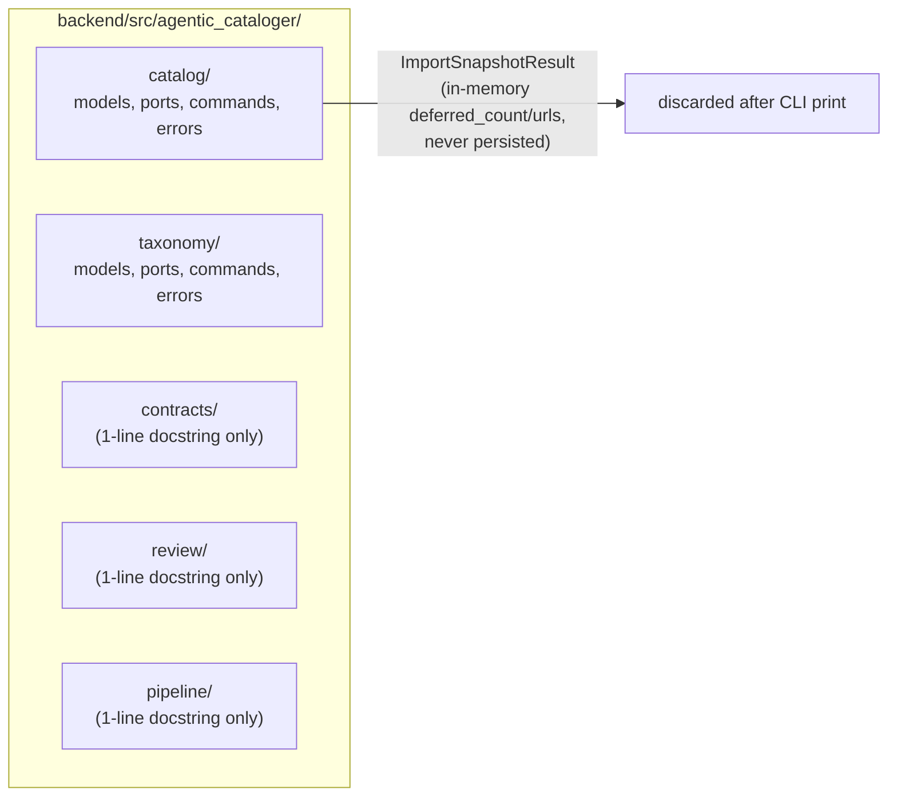
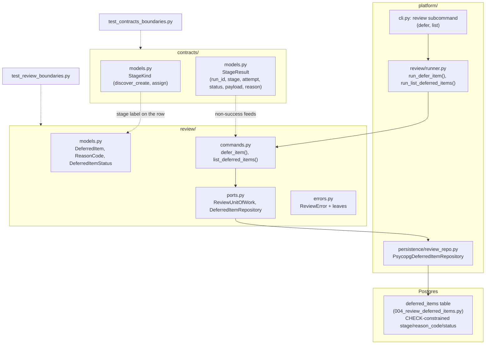

### Summary of change request

Roadmap items 4.1 and 3.1: define the shared run/stage/result vocabulary in a new `contracts` package, and add the `deferred_items` table (plus a real `review` package to write and read rows in it) so the agent has somewhere to put "I won't guess this" before it's allowed to refuse. Both are scoped to *discover/create and assign only* — no `extract` stage, no LangGraph node, no LLM call yet.

### Current State

- `contracts`, `review`, and `pipeline` exist only as one-line-docstring seed packages — no models, ports, commands, or errors. Nothing imports them for real code today.
- The run/stage/attempt vocabulary exists only as prose, in two different wordings that haven't been reconciled: the roadmap says "run ID, stage ID, LLM-call ID"; the architecture spec says `pipeline_run_id` / `stage_execution_id` / `stage_attempt_id`. No code anywhere defines any of these IDs.
- The "common result shape (success / defer / invalid + payload)" the roadmap asks for has no code precedent by that name either. The closest thing that exists, `ImportSnapshotResult`, is a per-run *count aggregate* (how many rows were deferred/collided across one ingest), not a per-call tri-state outcome — and it's owned by `catalog`, not `review`.
- There is no `deferred_items` table, migration, model, or persistence adapter anywhere. The field list is described in prose across two specs (`architecture.md`'s short bracketed list, `deferred-page.md`'s fuller UI-driven list) that haven't been reconciled into one schema either.
- Nothing in the codebase writes to Postgres without going through a domain command + Unit of Work (`catalog`/`taxonomy`'s pattern). `review` has no command surface, so there is currently no way — even manually via CLI — to record or read back "the agent won't guess this."

### Desired End State

- `contracts` defines the closed set of in-scope stage kinds (discover/create, assign) and one reusable stage-result type — keyed by the same `run_id` LangGraph/LangChain already generates for one graph invocation — that any stage/command can return, discriminating success from an explicit refusal to guess. No synthetic per-stage-execution or per-attempt IDs; "which attempt" is a plain count, matching how LangGraph itself tracks retries.
- `review` gets a real domain package (`models.py`/`ports.py`/`commands.py`/`errors.py`, same shape as `catalog`/`taxonomy`) plus a `deferred_items` migration, and a full vertical slice — persistence adapter, runner, and `review defer`/`review list` CLI subcommands (no `re-drive`, that stays roadmap 5.1) — so a `DeferredItem` can be written and read back through real commands, testable end-to-end from the CLI well before any LLM stage exists to call it.
- Both new packages get their own boundary test (mirroring `test_catalog_boundaries.py`/`test_taxonomy_boundaries.py`), so they stop being exempt from the framework-free rule they're already nominally covered by via `SEED_PACKAGES`.

### What we're not doing

- No LangGraph node, no LLM call, no `discover/create` or `assign` command handler — that's 4.4/4.5.
- No `extract` stage or its payload shape — that's 3.5.
- No in-app writes to `deferred_items` (reassign, edit, accept/reject) — explicitly out of MVP per `architecture.md`'s "Non-blocking human review" section.
- No re-drive command — that's roadmap 5.1, after the MVP.
- No deferred-items review page — that's roadmap 5.2, after the MVP, spec'd separately in `deferred-page.md`.
- No synthetic `stage_execution_id`/`stage_attempt_id` — see the resolved ID-vocabulary question below.
- No backfill of the `(AD-14)` decision record cited by the boundary tests — see the resolved decision-record question below.

### Proposed End State Architecture

Before:



After:



Contracts vocabulary:

```python
# contracts/models.py
class StageKind(StrEnum):
    """Closed set of in-scope pipeline stages."""
    DISCOVER_CREATE = "discover_create"
    ASSIGN = "assign"

@dataclass(frozen=True, slots=True)
class StageResult:
    """Outcome of one stage attempt, keyed by the LangGraph run it belongs to."""
    run_id: str  # reused as-is from LangGraph's ExecutionInfo.run_id / RunnableConfig.run_id
    stage: StageKind
    attempt: int
    status: Literal["success", "defer", "invalid"]
    payload: Mapping[str, object] | None = None
    reason: str | None = None
```

Review domain package:

```python
# review/models.py
class ReasonCode(StrEnum):
    UNKNOWN = "unknown"
    DEFER = "defer"
    LOW_CONFIDENCE = "low_confidence"

class DeferredItemStatus(StrEnum):
    OPEN = "open"

@dataclass(frozen=True, slots=True)
class DeferredItem:
    id: UUID
    product_id: UUID
    stage: StageKind
    reason_code: ReasonCode
    attempt_count: int
    payload_snapshot: Mapping[str, object]
    evidence_span: str | None = None
    trace_id: str | None = None
    status: DeferredItemStatus = DeferredItemStatus.OPEN
    created_at: datetime | None = None
```

```python
# review/commands.py
def defer_item(request: DeferItemRequest, *, repo: DeferredItemRepository, uow: ReviewUnitOfWork) -> DeferItemResult:
    item = DeferredItem(
        id=uuid7(),
        product_id=request.product_id,
        stage=request.stage,
        reason_code=request.reason_code,
        attempt_count=request.attempt_count,
        payload_snapshot=request.payload_snapshot,
        evidence_span=request.evidence_span,
        trace_id=request.trace_id,
        status=DeferredItemStatus.OPEN,
    )
    repo.add(item)
    uow.commit()
    logger.info(...)
    return DeferItemResult(item=item)


def list_deferred_items(*, repo: DeferredItemRepository) -> ListDeferredItemsResult:
    """Read-only — no request, no UoW, same shape as `show_taxonomy`."""
    return ListDeferredItemsResult(items=repo.list_open())
```

### Design Questions

None open. All questions raised during review are resolved below.

### Resolved Design Questions

#### Canonical ID vocabulary: how many IDs, and what to call them

**Decided: mint only `run_id` (Option D)** — reuse LangGraph/LangChain's own field verbatim (plain `str`, no wrapper dataclass). Don't synthesize `stage_execution_id`/`stage_attempt_id` at all; represent "which stage" as the `StageKind` label and "which attempt" as a plain `int` counter (mirroring LangGraph's own `node_attempt`), relying on the natural composite `(run_id, product_id, stage)` wherever "which execution" needs disambiguating.

Rationale: `deferred_items` (this ticket's own table) only has columns for a stage *label* and an attempt *count* per architecture.md's field list — never a synthetic per-execution ID. The one feature that would need a durable per-attempt row to key a replay lookup by (`architecture.md:106`) is roadmap item 4.2, explicitly cut from the MVP line until 6.2 exists. LangGraph's own `ExecutionInfo` confirms the shape of what's available for free: `run_id` (matches `RunnableConfig.run_id`, also what Phoenix/OpenInference correlates spans by), `task_id` (per-node execution, LangGraph-internal, not durable/replayable), `node_attempt` (an `int` retry counter, not a minted ID). Minting `stage_execution_id`/`stage_attempt_id` now would be plumbing for a lookup that doesn't exist yet; add a synthetic PK if/when 4.2's durable-outcomes table actually needs one.

Options not chosen:
- Adopting `architecture.md`'s exact three-ID vocabulary (`pipeline_run_id`/`stage_execution_id`/`stage_attempt_id`) or the roadmap's shorter gloss (`run_id`/`stage_id`/`llm_call_id`) — both would mint two IDs nothing currently consumes.
- Aligning `run_id` with LangGraph but still minting our own `stage_execution_id`/`stage_attempt_id` UUIDs — same "nothing consumes it yet" problem, just with `run_id` naming fixed.

#### Stage-result shape: one dataclass vs. a closed union

**Decided: one frozen dataclass** with `status: Literal["success", "defer", "invalid"]`, a single `payload`/`reason` pair, matching the roadmap's own phrasing — "a common result shape... + payload" reads as one shape, not three.

Rationale: nothing in the codebase today models a discriminated union (`ImportSnapshotResult` is a flat count aggregate, not a tri-state outcome); a single dataclass is the simplest thing that satisfies the roadmap wording and matches every existing `*Result` type's shape.

Option not chosen: a closed sum type (`StageSuccess`/`StageDefer`/`StageInvalid` unioned as `StageResult`) — more type-safe (no field is ever meaningless for its variant), but worth revisiting once 4.4 gives `discover/create` and `assign` genuinely different payload types and the "meaningless field" cost becomes real.

#### Restricted-vocabulary fields: plain `str` vs. `enum.StrEnum` + DB `CHECK`

**Decided: `enum.StrEnum` in `contracts.models`/`review.models` for `StageKind`, `StageResult.status`, `ReasonCode`, and `DeferredItemStatus`, mirrored as named `CHECK` constraints on the corresponding `deferred_items` columns in the migration.** First `Enum` and first multi-value `CHECK` constraint in the codebase (today's only `CHECK` is the single-column `taxonomy_categories_no_self_parent_chk`) — a deliberate, flagged precedent, not a quiet one.

Rationale: these vocabularies are small, fully-known, and static today — unlike `currency`/`source_namespace`, which are open/externally-sourced and validated one layer upstream via a plain dict lookup. `StrEnum` is exactly the tool for a closed set; the matching `CHECK` constraint is cheap insurance against a bug or a future second writer inserting a bad value directly.

Options not chosen:
- Plain `str` everywhere, zero new precedent — would leave these genuinely closed sets with the same open-ended representation as the codebase's actually-open fields.
- `StrEnum` in Python only, unconstrained `TEXT` in the migration — app-layer safety without the DB-level backstop.

#### Reconciling "success / defer / invalid" (roadmap) with "unknown / defer / low_confidence" (architecture/deferred-page)

**Decided: two-level model.** `StageResult.status` (`contracts`) is the coarse three-way outcome of one command call. `DeferredItem.reason_code` (`review`) is a finer-grained "why," populated whenever `status != "success"` — e.g. an `"invalid"` stage result (validator rejected an uncited trait/assignment) still produces a `deferred_items` row, with a `reason_code` the stage chooses (`unknown`, `low_confidence`, or a validator-specific code later), not necessarily literally `"invalid"`.

Rationale: matches the ownership line `architecture.md` draws explicitly ("review owns deferred items; pipeline owns run/stage coordination") and lets `reason_code` grow new values later without every new reason code forcing a change to `contracts`' stage-result contract.

Option not chosen: one shared flat enum reused at both levels (with `"success"` simply never appearing on a `deferred_items` row) — couples the two packages' vocabularies more tightly than their stated ownership split implies.

#### `deferred_items` exact column list and types

**Decided:** the column list as sketched below, with `status` constrained to `'open'` only for now.

| Column | Type | Notes |
| --- | --- | --- |
| `id` | `UUID PRIMARY KEY` | app-minted `uuid7()` |
| `product_id` | `UUID NOT NULL REFERENCES catalog_products (id)` | non-unique, indexed — see FK question below |
| `stage` | `TEXT NOT NULL CHECK (...)` | `StageKind` values: `discover_create`, `assign` |
| `reason_code` | `TEXT NOT NULL CHECK (...)` | `ReasonCode` values: `unknown`, `defer`, `low_confidence` |
| `attempt_count` | `INTEGER NOT NULL` | |
| `payload_snapshot` | `JSONB NOT NULL` | first JSONB column in the schema — everything else is `TEXT`/`NUMERIC`/`TIMESTAMPTZ` today |
| `evidence_span` | `TEXT`, nullable | "if present" per `deferred-page.md` |
| `trace_id` | `TEXT`, nullable | spec explicitly allows missing |
| `status` | `TEXT NOT NULL DEFAULT 'open' CHECK (status IN ('open'))` | only `'open'` for now |
| `created_at` | `TIMESTAMPTZ NOT NULL DEFAULT now()` | needed for `deferred-page.md`'s "relative time" |

Rationale for `status` staying single-valued: YAGNI — widening a `CHECK` constraint later is a one-line migration, and 5.1 hasn't designed re-drive/resolution semantics yet, so a second status value today would be a guess.

#### Non-unique FK from `deferred_items.product_id` to `catalog_products.id`

**Decided:** `product_id UUID NOT NULL REFERENCES catalog_products (id)` plus a plain `CREATE INDEX deferred_items_product_id_idx ON deferred_items (product_id)`. No additional `status`-scoped index for now.

Rationale: this is the first table in the schema where a product FK is neither the primary key nor unique (the one precedent, `taxonomy_memberships.product_id`, *is* the PK). Postgres never auto-indexes a non-PK FK column, so the plain index is required regardless. A `status`-scoped (or partial `WHERE status = 'open'`) index is deferred until 5.1/5.2 profiling shows the open-items query actually needs it — same "build one only if read latency is actually measured" precedent already set for comparable price in `architecture.md`.

#### How much of `review` to build for 3.1

**Decided: full vertical slice, write and read, no re-drive.** Domain package (`models.py`/`ports.py`/`commands.py`/`errors.py`) + migration + `PsycopgDeferredItemRepository` + runner + `review defer`/`review list` CLI subcommands. `re-drive` stays out — that's roadmap 5.1.

Rationale: matches how `catalog`/`taxonomy` commands were all built CLI-testable ahead of the agent/UI that would eventually call them (M1's own note: "All three are plain application commands, testable from the CLI"), and resolves the roadmap's internal tension between the "Done when" block (which lists `deferred list` as MVP acceptance) and the "After the MVP" section (which slots `deferred list` under 5.1) in favor of building it now, minus the one piece (`re-drive`) that's unambiguously scoped to 5.1 in both places.

Option not chosen: domain-only + migration, or write-path-only — both would leave `deferred list` unbuilt despite it appearing in the roadmap's own MVP "Done when" acceptance command sequence.

#### The `(AD-14)` citation in the boundary tests has no target

**Decided: out of scope for this ticket.** Don't backfill `docs/decision_records/AD-14-....md` as part of 4.1/3.1. Whether any of today's genuinely new precedents (the `run_id`-only ID vocabulary, the first `StrEnum`+`CHECK` pairing) warrant their own fresh decision record is left open, not mandated by this design — that call can be made at implementation/outline time if it turns out to matter beyond this task.

Rationale (user call): the missing AD-14 predates this task and isn't blocking it; conflating "fix a dangling citation" with "ship two roadmap items" isn't worth doing in the same change.

### Patterns to follow

These show the patterns found in the existing codebase that will be followed to implement the proposed end state architecture.

#### Domain package shape — `taxonomy`/`catalog` as the literal template

`backend/src/agentic_cataloger/taxonomy/` — `@dataclass(frozen=True, slots=True)` models, one `*UnitOfWork` Protocol plus repository Protocols in `ports.py`, a flat `*Error(Exception)` hierarchy in `errors.py`, and `commands.py` functions shaped `def command_name(request: XRequest, *, <ports>, uow: <UnitOfWork>) -> XResult:` with request positional and every port keyword-only, closing with an explicit `__all__`. A pure read (no mutation) drops both `request` and `uow`:

```python
# taxonomy/commands.py:211 — show_taxonomy is read-only, no request, no uow
def show_taxonomy(*, categories: CategoryRepository, memberships: MembershipRepository) -> TaxonomyTree:
    ...
```

`review.list_deferred_items()` should follow this exact read-only shape; `defer_item()` follows the mutating shape (`request` positional, `repo`/`uow` keyword-only).

```python
# taxonomy/ports.py:13-22
class TaxonomyUnitOfWork(Protocol):
    """One transactional boundary for taxonomy writes."""
    def commit(self) -> None:
        """Commit the unit of work."""
        ...
    def rollback(self) -> None:
        """Roll back the unit of work."""
        ...
```

`contracts` and `review` should follow this exact shape: `ReviewUnitOfWork`/`DeferredItemRepository` Protocols in `review/ports.py`, `ReviewError` + leaves in `review/errors.py`.

#### IDs minted with stdlib `uuid7()`, no wrapper helper

```python
# catalog/commands.py:171
id=uuid7()  # comment: "Always mint a UUIDv7; ON CONFLICT keeps the existing row id."
```

`DeferredItem.id` should be minted the same way, inline in `defer_item()`, importing `uuid7` directly from `uuid`.

#### Migrations: raw `op.execute()` SQL, `<table>_<purpose>_<kind>` naming, unnamed inline FKs, named `CHECK` constraints

```python
# 003_taxonomy_tree.py:16-27
CREATE TABLE taxonomy_categories (
    id UUID PRIMARY KEY,
    name TEXT NOT NULL,
    parent_id UUID REFERENCES taxonomy_categories (id),
    preferred_comparable_unit TEXT,
    created_at TIMESTAMPTZ NOT NULL DEFAULT now(),
    updated_at TIMESTAMPTZ NOT NULL DEFAULT now(),
    CONSTRAINT taxonomy_categories_no_self_parent_chk
        CHECK (parent_id IS DISTINCT FROM id)
)
```

The new `004_review_deferred_items.py` follows this exactly — `op.execute()` only, no `op.create_table`, `revision`/`down_revision` chained onto `003_taxonomy_tree`, and a named `CHECK` per closed vocabulary:

```sql
CREATE TABLE deferred_items (
    id UUID PRIMARY KEY,
    product_id UUID NOT NULL REFERENCES catalog_products (id),
    stage TEXT NOT NULL,
    reason_code TEXT NOT NULL,
    attempt_count INTEGER NOT NULL,
    payload_snapshot JSONB NOT NULL,
    evidence_span TEXT,
    trace_id TEXT,
    status TEXT NOT NULL DEFAULT 'open',
    created_at TIMESTAMPTZ NOT NULL DEFAULT now(),
    CONSTRAINT deferred_items_stage_chk
        CHECK (stage IN ('discover_create', 'assign')),
    CONSTRAINT deferred_items_reason_code_chk
        CHECK (reason_code IN ('unknown', 'defer', 'low_confidence')),
    CONSTRAINT deferred_items_status_chk
        CHECK (status IN ('open'))
);

CREATE INDEX deferred_items_product_id_idx ON deferred_items (product_id);
```

#### Persistence adapter + runner + CLI dispatch

```python
# platform/persistence/catalog_repo.py:135-153
def get_by_source_identity(self, identity: SourceIdentity) -> CatalogProduct | None:
    row = self._conn.execute(
        """
        SELECT * FROM catalog_products
        WHERE source_namespace = %s AND source_product_id = %s
          AND source_variant_id IS NOT DISTINCT FROM %s
        """,
        (identity.source_namespace, identity.source_product_id, identity.source_variant_id),
    ).fetchone()
    ...
```

A `PsycopgDeferredItemRepository` in a new `platform/persistence/review_repo.py` holds raw parametrized SQL the same way, `@final`, reusing the shared `PsycopgUnitOfWork`/`connect_app` exactly as `taxonomy_repo.py` re-exports it rather than redefining it. `platform/review/runner.py` and `platform/cli.py`'s `review` subcommand (with `defer`/`list` actions) mirror `platform/taxonomy/runner.py` and its `argparse` subparsers.

#### Boundary test — direct template

```python
# test_taxonomy_boundaries.py:11-19
FORBIDDEN = {
    "psycopg", "sqlalchemy", "alembic", "fastapi",
    "langchain", "langgraph", "opentelemetry",
}
```

`test_contracts_boundaries.py` and `test_review_boundaries.py` copy this `FORBIDDEN` set and the two-test structure (`test_{package}_root_contains_python_modules`, `test_{package}_has_no_adapter_imports`) verbatim, swapping only the package root constant.
