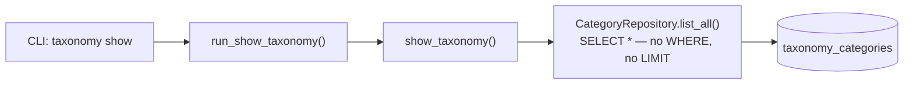
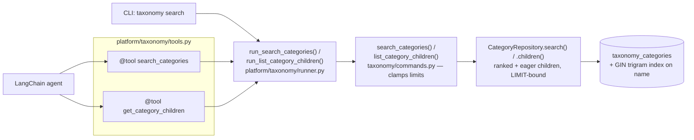

### Summary of change request

Roadmap story 2.5: give the agent a way to look up existing categories in the substitutability tree without ever getting the whole tree (or a subtree) dumped into its prompt. `docs/specs/architecture.md` and `docs/specs/2026-scope.md` both call this a hard token-budget constraint, not an optimization. MVP delivery is LangChain tools wired directly over the existing `taxonomy` command layer — MCP is a separate, later story (1.10) that wraps the same tools in a different transport.

### Current State

- The only way to read the taxonomy today is `agentic-cataloger taxonomy show`, which walks CLI → `run_show_taxonomy()` → `show_taxonomy()` → `CategoryRepository.list_all()` — one unfiltered `SELECT * FROM taxonomy_categories`, no `WHERE`, no `LIMIT`.
- That same unfiltered read also backs `reparent_category` and `assign_product_to_leaf` internally (they load everything to check cycles / leaf status in Python), but those aren't agent-facing reads — this story only replaces the agent's context path.
- There's no search, filtering, or ranking of categories anywhere. No `CREATE EXTENSION`, no `tsvector`, no trigram index, no `ILIKE`-based lookup exists in the schema or codebase, for taxonomy or any other table.
- No LangChain tool code exists anywhere in the codebase yet. `langchain-core` is a declared dependency (pinned in `backend/pyproject.toml`) but nothing imports it.

### Desired End State

- An LLM agent (and a human via CLI, for parity/debugging) can search categories by name and get back a small, ranked set of candidates — not the whole tree.
- Search is typo-tolerant and ranked, not exact/substring matching — a plain `ILIKE` lookup was explicitly rejected as too close to the "keyword-only category matching" pattern the specs call out.
- Each match carries enough context (parent name, leaf/non-leaf, and its own immediate children) that a caller can decide "assign here," "assign to this leaf child," "create a new child," or "create fresh" without a follow-up call for the common one-hop case.
- A second tool lets the agent browse a category's children directly, for cases eager children don't cover (going deeper than one level, browsing from the root, or a branch with more children than fit in one match).
- Every result set — search matches and children lists alike — is capped on the server side, so no caller, including a misbehaving or overly-eager LLM tool call, can turn "search" or "browse" into "dump."

### What we're not doing

- No MCP transport. Roadmap 1.10 wraps the same command layer this story builds; that's explicitly deferred.
- No embeddings / pgvector. `2026-scope.md`'s deferred table lists "C4 embed shortlist" as revisit-when-C2-search-shows-a-measured-ceiling, not MVP work.
- No new mutation tools (merge, rename, reparent) — those commands already exist (`create_category`, `reparent_category`) and are out of scope here; this story is read-only category *context*.
- No search over catalog product fields (`source_category`, `unified_category`, etc.) — scope is `taxonomy_categories.name` only.

### Proposed End State Architecture

Before:



After:



Concise outline of the new pieces, following the shape every other taxonomy read/write already uses (`*Request` in → command function → `*Result` out, port method, Psycopg adapter, runner wiring, CLI dispatch):

1. **Migration `004_taxonomy_search.py`** — enable `pg_trgm`, add a GIN trigram index on `taxonomy_categories.name`. `MIGRATE_DATABASE_URL` already connects as a superuser (see `platform/roles/migrate.py`), so `CREATE EXTENSION` needs no new privilege wiring.

    ```sql
    CREATE EXTENSION IF NOT EXISTS pg_trgm;
    CREATE INDEX taxonomy_categories_name_trgm_idx
        ON taxonomy_categories USING GIN (name gin_trgm_ops);
    ```

2. **New result models** in `taxonomy/models.py` — a search hit isn't a persisted row, it's `Category` plus context computed at query time, now including eager children and their true count (so a capped list is never silently mistaken for the whole set):

    ```python
    CHILDREN_LIMIT = 50

    @dataclass(frozen=True, slots=True)
    class CategoryMatch:
        category: Category
        parent_name: str | None
        is_leaf: bool
        score: float
        children: tuple[Category, ...]   # capped at CHILDREN_LIMIT
        child_count: int                 # true count, may exceed len(children)

    @dataclass(frozen=True, slots=True)
    class SearchCategoriesResult:
        matches: tuple[CategoryMatch, ...]

    @dataclass(frozen=True, slots=True)
    class ListCategoryChildrenResult:
        children: tuple[Category, ...]   # capped at CHILDREN_LIMIT
        child_count: int
    ```

3. **New port methods** on `CategoryRepository` in `taxonomy/ports.py`:

    ```python
    def search(self, query: str, *, limit: int) -> Sequence[CategoryMatch]:
        """Return categories ranked by name similarity to `query`, capped at `limit`."""
        ...

    def children(self, parent_id: UUID | None, *, limit: int) -> tuple[Sequence[Category], int]:
        """Return immediate children of `parent_id` (None = root categories),
        capped at `limit`, plus the true child count."""
        ...
    ```

4. **New commands** in `taxonomy/commands.py`, matching the bare-function shape `show_taxonomy` already uses for reads (no `uow`, since nothing is written), clamping limits server-side so the "no full dump, ever" rule can't be bypassed by a caller-supplied limit, and logging loudly when a result was actually truncated:

    ```python
    DEFAULT_SEARCH_RESULTS = 20
    MAX_SEARCH_RESULTS = 40

    @dataclass(frozen=True, slots=True)
    class SearchCategoriesRequest:
        query: str
        limit: int | None = None

    def search_categories(
        request: SearchCategoriesRequest, *, categories: CategoryRepository,
    ) -> SearchCategoriesResult:
        query = request.query.strip()
        if not query:
            raise ValueError("Search query must be non-empty")
        limit = min(request.limit or DEFAULT_SEARCH_RESULTS, MAX_SEARCH_RESULTS)
        matches = tuple(categories.search(query, limit=limit))
        for match in matches:
            if match.child_count >= CHILDREN_LIMIT:
                logger.warning(
                    "Category %s has %d children (>= cap %d); children list truncated",
                    match.category.id, match.child_count, CHILDREN_LIMIT,
                )
        return SearchCategoriesResult(matches=matches)

    @dataclass(frozen=True, slots=True)
    class ListCategoryChildrenRequest:
        parent_id: UUID | None = None
        limit: int | None = None

    def list_category_children(
        request: ListCategoryChildrenRequest, *, categories: CategoryRepository,
    ) -> ListCategoryChildrenResult:
        limit = min(request.limit or CHILDREN_LIMIT, CHILDREN_LIMIT)
        children, child_count = categories.children(request.parent_id, limit=limit)
        if child_count >= CHILDREN_LIMIT:
            logger.warning(
                "Category %s has %d children (>= cap %d); children list truncated",
                request.parent_id, child_count, CHILDREN_LIMIT,
            )
        return ListCategoryChildrenResult(children=tuple(children), child_count=child_count)
    ```

5. **`PsycopgCategoryRepository.search()` / `.children()`** in `platform/persistence/taxonomy_repo.py` — filter, rank, and nest children entirely in SQL. Children are aggregated into a per-match array via a correlated `LATERAL`/subquery, not a flat `JOIN`, so there's no row fan-out to de-duplicate in Python:

    ```sql
    SELECT c.id, c.name, c.parent_id, c.preferred_comparable_unit,
           c.created_at, c.updated_at,
           p.name AS parent_name,
           NOT EXISTS (SELECT 1 FROM taxonomy_categories x WHERE x.parent_id = c.id) AS is_leaf,
           similarity(c.name, %(query)s) AS score,
           COALESCE(kids.children, '[]'::jsonb) AS children,
           COALESCE(kids.child_count, 0) AS child_count
    FROM taxonomy_categories c
    LEFT JOIN taxonomy_categories p ON p.id = c.parent_id
    LEFT JOIN LATERAL (
        SELECT
            jsonb_agg(jsonb_build_object('id', ch.id, 'name', ch.name)
                      ORDER BY ch.name) FILTER (WHERE ch.rn <= %(children_limit)s) AS children,
            count(*) AS child_count
        FROM (
            SELECT id, name, row_number() OVER (ORDER BY name) AS rn
            FROM taxonomy_categories WHERE parent_id = c.id
        ) ch
    ) kids ON true
    WHERE c.name %% %(query)s
    ORDER BY score DESC, c.name
    LIMIT %(limit)s
    ```

6. **`run_search_categories()` / `run_list_category_children()`** in `platform/taxonomy/runner.py`, same shape as `run_show_taxonomy`:

    ```python
    def run_search_categories(
        *, query: str, limit: int | None = None, database_url: str | None = None,
    ) -> SearchCategoriesResult:
        url = _require_database_url(database_url)
        with connect_app(url) as conn:
            return search_categories(
                SearchCategoriesRequest(query=query, limit=limit),
                categories=PsycopgCategoryRepository(conn),
            )
    ```

7. **New `platform/taxonomy/tools.py`** — the only module allowed to import `langchain` for taxonomy (the boundary test forbids it inside `taxonomy/`). Wraps the runner calls and formats compact strings, since a plain string return becomes `ToolMessage.content` directly with no schema-repetition tax. The `search_categories` docstring names the search's actual characteristics (typo-tolerant, ranked, not substring matching) so the model calibrates when to call it again with a different query versus reach for `get_category_children`:

    ```python
    from langchain_core.tools import tool
    from agentic_cataloger.platform.taxonomy.runner import (
        run_list_category_children,
        run_search_categories,
    )

    @tool
    def search_categories(query: str, limit: int = 20) -> str:
        """Fuzzy-search the substitutability category tree by category name.

        Typo-tolerant and ranked by similarity, not exact/substring matching —
        close variants and misspellings still surface. Returns up to `limit`
        ranked matches (default 20, max 40); each match includes its parent
        name, leaf/non-leaf status, and up to 50 immediate children (useful
        when a match is a branch, since assignment always targets a leaf).
        Never returns the full tree or a subtree — call again with a
        different query, or use get_category_children to go deeper, instead
        of raising `limit`.
        """
        result = run_search_categories(query=query, limit=limit)
        if not result.matches:
            return "no matches"
        return "\n".join(_format_match(m) for m in result.matches)

    @tool
    def get_category_children(category_id: str | None = None, limit: int = 50) -> str:
        """List the immediate children of one category, or root categories if
        `category_id` is omitted. Bounded to `limit` (max 50) — never a
        subtree or the full tree. Use this to go past the children already
        included in a search_categories match, or to browse when search finds
        nothing close enough.
        """
        result = run_list_category_children(parent_id=category_id, limit=limit)
        if not result.children:
            return "no children"
        lines = [f"{c.name} [{c.id}]" for c in result.children]
        if result.child_count > len(result.children):
            lines.append(f"... {result.child_count - len(result.children)} more, not shown")
        return "\n".join(lines)
    ```

8. **CLI `taxonomy search --query ... [--limit N]`** subcommand, matching the existing convention where every command has a CLI entry point (`create`/`reparent`/`show`/`assign` all do).

### Design Questions

None currently open — all questions raised during review were resolved below.

### Resolved Design Questions

#### Search must be smarter than plain keyword matching

**Option A** — resolved. The "keyword-only category matching" line in `architecture.md`'s Won't-build list is read as constraining the *search/retrieval mechanism itself*, not only the substitutability *decision*: a plain `ILIKE` lookup doesn't satisfy it. Rationale: even though the agent can issue multiple searches (which somewhat compensates for a weak single query), that's not a reason to ship weak retrieval — similarity-ranked, typo-tolerant search is cheap to build and removes the ambiguity outright.

Option B (only the assignment decision needs to avoid keyword-only logic; retrieval mechanism is unconstrained) was considered and not chosen.

#### Search backend: `pg_trgm` trigram similarity

**Option A (`pg_trgm`)** chosen. It satisfies the "smarter than plain keyword matching" resolution above (typo/partial-word tolerant, ranked), needs no per-language stemming config, and category names are short human-authored labels — exactly what trigram similarity targets. Bundled in the official `postgres:18.4` image, just needs `CREATE EXTENSION`.

**Option C (plain `ILIKE '%query%'`)** — explicitly rejected.

Option B (Postgres full-text search, `tsvector`/`ts_rank`) was considered and not chosen: better suited to long documents and stemmed/weighted multi-field search, and would need a language-config decision the schema doesn't currently support (no `name_de` on categories, unlike `catalog_products`).

#### `CategoryMatch` carries eager children, deduplicated at DB level

Resolved: each match includes its immediate children (id + name), capped at 50 (`CHILDREN_LIMIT`), plus the true `child_count` so a capped list is never silently mistaken for "these are all of them." The command layer logs loudly (`logger.warning`) whenever a category's real child count is at or above the cap. Rationale: the end goal of a search is always to get a product onto a *leaf*, so when a match is a non-leaf branch, its children are exactly what's needed next — returning them eagerly avoids a guaranteed follow-up call for the common case. Deduplication happens at the DB level by construction: children are nested per match row via a `LATERAL` subquery with `jsonb_agg`, not produced by a flat `JOIN` that would fan out one row per child and need app-level de-duplication.

A `member_count`-only shape (no children, just a number) was considered in the first draft and superseded — a bare count doesn't let the caller act without another round trip, while children do.

#### Ship both `search_categories` and `get_category_children`

**Option B** — resolved. Ship both tools now, on top of returning children eagerly inside search matches. Rationale: eager children cover the common one-hop case for free, but a standalone `get_category_children` still earns its place for descending more than one level, browsing from the root when search turns up nothing close enough, and the overflow case where a match's `child_count` exceeds the 50-child cap on what's embedded.

Option A (ship search only, add a children tool later if needed) was considered and superseded — once children are part of the match shape anyway, the standalone tool is a small increment, not a speculative one.

#### Tool module location: `platform/taxonomy/tools.py`

**Option A** — resolved as originally proposed. Sibling to the existing `platform/taxonomy/runner.py`, matching the current one-package-per-domain layout; no `platform/agents/`-style cross-domain module exists or is needed yet.

Option B (a shared cross-domain tools module anticipating future catalog/enrichment tools) was considered and not chosen — revisit only once a second domain actually needs agent tools.

#### Result cap: default 20, hard ceiling 40, `limit` stays an agent-controllable argument

Resolved: `DEFAULT_SEARCH_RESULTS = 20`, `MAX_SEARCH_RESULTS = 40`, clamped server-side inside `search_categories()` regardless of caller (CLI, LangChain tool, future MCP). `limit` stays exposed as an optional argument rather than being fixed at the default.

The alternative (hide `limit` entirely, always return the default count) was considered and not chosen — it removes a legitimate "give me a couple more candidates" case, and the server-side clamp is what actually enforces "no full dump, ever" either way, independent of whether `limit` is exposed.

### Patterns to follow

These show the patterns found in the existing codebase that will be followed to implement the proposed end state architecture.

#### `*Request` / function / `*Result` triple

`taxonomy/commands.py`'s existing commands (e.g. `create_category`, `taxonomy/commands.py:66-133`) take one frozen `*Request` dataclass plus injected ports, and return one frozen `*Result`. `show_taxonomy` (`commands.py:211-220`) is the one existing read and already drops the `uow` parameter since there's nothing to commit — `search_categories` and `list_category_children` follow that same reduced shape.

```python
# existing read, commands.py:211-220
def show_taxonomy(*, categories: CategoryRepository) -> TaxonomyTree:
    return TaxonomyTree(categories=tuple(categories.list_all()))
```

```python
# proposed, same shape, adds a request dataclass since search/children take input
def search_categories(
    request: SearchCategoriesRequest, *, categories: CategoryRepository,
) -> SearchCategoriesResult:
    ...
```

#### Filter/aggregate in SQL, not in Python

Every `CategoryRepository`/`MembershipRepository` method except `list_all()` already pushes filtering into the query (`platform/persistence/taxonomy_repo.py`) — e.g. `count_for_category` does `SELECT count(*) ... WHERE category_id = %s` rather than loading rows and counting in Python. `search()`/`children()` follow the same rule: ranking, the leaf check, the parent-name lookup, and the nested-children aggregation all happen in one SQL statement each, via a `LATERAL` subquery rather than a row-fanning `JOIN` — so there's no Python-side de-duplication step either.

#### `run_*` wiring: open connection, build repos, call the command

Every `platform/taxonomy/runner.py` function (e.g. `run_show_taxonomy`, `runner.py:121-132`) resolves the database URL, opens one connection, constructs fresh repository instances bound to it, and calls straight into the matching `taxonomy.commands` function. `run_search_categories`/`run_list_category_children` are the same shape, just with the new commands and a request built from keyword args.

#### `@final` Protocol adapters

`PsycopgCategoryRepository` (`platform/persistence/taxonomy_repo.py:33`) is `@final` and implements `CategoryRepository` directly — no extra abstraction layer. The new `search()`/`children()` methods are added to that same class, not a new adapter class.

#### CLI dispatch: one subparser + one `if` branch per subcommand

`platform/cli.py:_run_taxonomy`/`_dispatch_taxonomy` (`cli.py:143-299`) registers one argparse subparser per operation and dispatches through a flat `if/elif` chain, catching `TaxonomyError` once at the top. `search` slots in the same way `show` does today, with no special-casing.

#### Testing split: fakes for orchestration, real Postgres for ranking behavior

`backend/tests/domain/test_taxonomy_tree.py` uses hand-written `@final` dataclass fakes (`_FakeCategories`, over a plain `dict[UUID, Category]`) to test command orchestration without a database. `backend/tests/integration/test_taxonomy_persist.py` runs the same commands against a real, migrated Postgres instance. `search_categories`/`list_category_children` split the same way: domain tests exercise the clamp/validation/truncation-logging logic against a fake `search()`/`children()` (a trivial Python substring match and dict-based children lookup are enough — they don't need to replicate `pg_trgm` ranking), while ranking/typo-tolerance/index behavior and the `LATERAL` aggregation get their own `@pytest.mark.integration` tests against the real trigram index.
