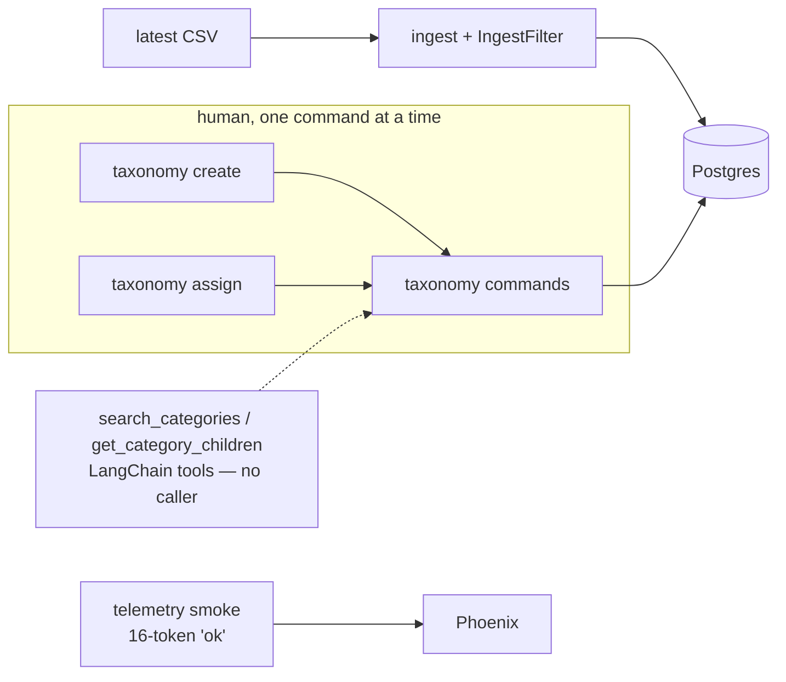
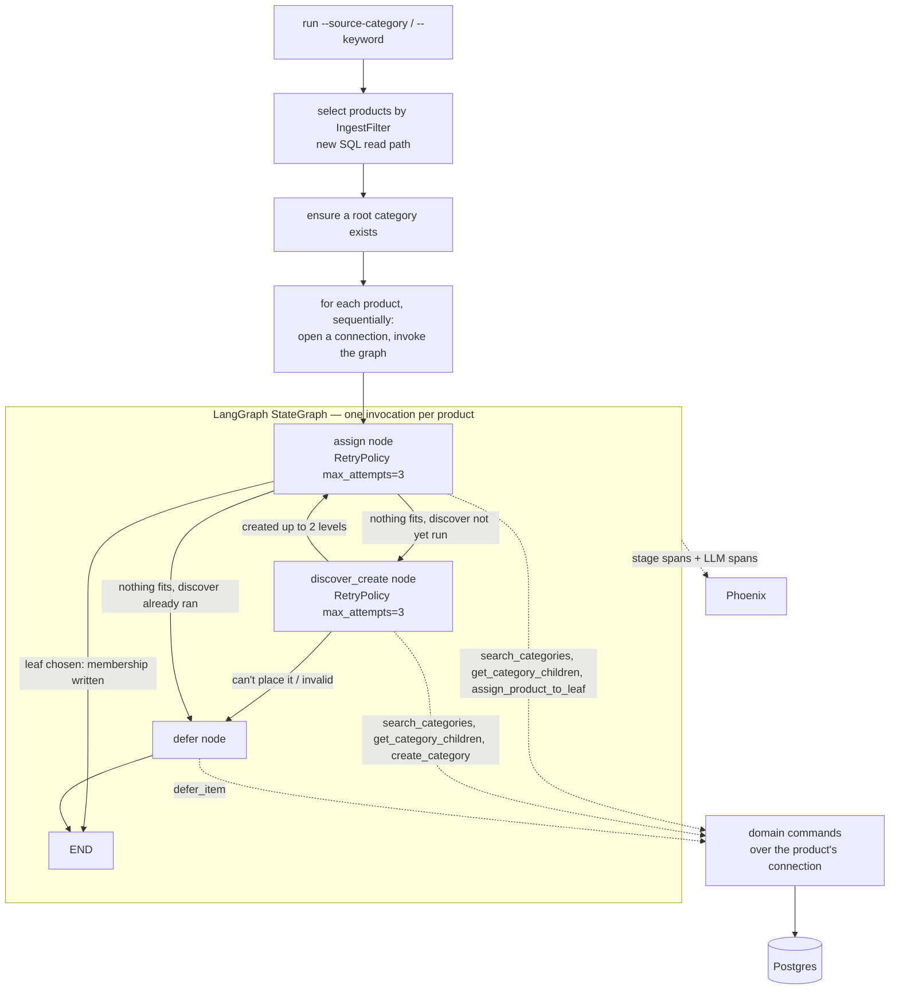

### Summary of change request

Build the agent. Three roadmap stories land together because they're one feature:

- **4.4** — discover/create and assign run as two separately-prompted stages; same-call create+assign stays structurally impossible.
- **2.6** — the discover stage prefers matching an existing category over creating a new one; no draft/provisional category state.
- **4.5** — LangGraph orchestrates the two stages, a run is launched from an ingest filter (1.5, the `--source-category` / `--keyword` criteria object), and node-level `RetryPolicy` covers flaky LLM calls.

This is the first code in the repo that calls an LLM for real work, the first `StateGraph`, and the first query that pulls a *set* of products back out of Postgres.

### Current State

- Products land in the database from a CSV scrape, filterable by retailer category or keyword (`ingest --source-category "Milchprodukte"`).
- The substitutability tree exists and is fully usable — but only by hand. Someone types `taxonomy create`, `taxonomy assign`, `taxonomy show` one command at a time.
- Fuzzy category search is exposed to an LLM as two LangChain tools, and nothing calls them. No agent exists to hold the other end.
- There's a table for "I won't guess this" (deferred items) and a CLI to write rows into it manually. Nothing produces one automatically.
- Tracing is wired to Phoenix and a smoke command proves it works, but the only LLM call in the repo is a 16-token "reply with the word ok".
- Net: after ingesting 4,000 Migros rows there is no path to a populated tree short of a human doing it by hand.

### Desired End State

- One command does the whole thing: `agentic-cataloger run --source-category "Milchprodukte"` picks up the matching products and categorizes them.
- For each product, **assign** runs first: it searches the tree and either places the product in a leaf that already fits, or reports that nothing does. Only on that miss does the separately-prompted **discover/create** stage run and build the missing category; assign is then re-prompted fresh against the extended tree. Neither prompt can do the other's job — the create tool isn't bound in the assign stage and vice versa.
- Because creation is only reachable through an explicit assign miss, "prefer matching an existing category before creating" is a property of the graph, not a request in a prompt. On top of that, a create proposal that names no rejected candidates is refused by the node.
- Most products cost one LLM stage, not two. The cost of building the tree is paid on the products that actually extend it.
- When either stage isn't confident, it writes a `deferred_items` row with the stage, the reason, and the payload it was looking at — instead of guessing.
- Phoenix shows one trace per product with two separately-scored stages and per-call token cost.
- `taxonomy show` prints a real tree; `review list` prints what the agent refused to guess.

### What we're not doing

- **No extract stage.** Traits/units/quantities are old Epic 3, behind the MVP. Two stages only.
- **No durable stage outcomes / replay (4.2).** A re-run re-calls the LLM. Explicitly cut until the eval set costs real money.
- **No hygiene commands (2.7).** The agent will fragment the tree; 2.6 reduces it, repair comes later.
- **No advisory lock (1.3), no idempotency keys (1.8).** One dev, one process, don't run two at once.
- **No eval / accuracy scoring (6.x).** "Does the tree look like garbage" is a human eyeball at MVP.
- **No MCP transport (1.10).** LangChain tools directly.
- **No `preferred_comparable_unit` validation.** The create stage may fill the column opportunistically (roadmap note); nothing checks it.
- **No web page.** CLI only.

### Proposed End State Architecture

Before:



After:



The `nothing fits, discover already ran` edge is the ping-pong guard: **at most one discover per product**, tracked in graph state. Worst case is three model turns (assign miss → create → assign), best and most common case is one.

**Package split.** `pipeline/` (domain) gains the stage decision types, an LLM port, and a product-selection port — no `langgraph`, no `langchain`, enforced by the existing AST boundary test. `platform/pipeline/` (new) holds the graph, the nodes, the prompts, the tool bindings, and the chat-model adapter.

```text
backend/src/agentic_cataloger/
  pipeline/
    ports.py          # existing Telemetry/SpanHandle + new StageAgent, RunProductRepository
    models.py         # NEW: StageDecision, RunProductRef, RunSummary
    commands.py       # NEW: select_run_products(), pure stage-outcome → effect rules
  platform/pipeline/
    graph.py          # NEW: build_stage_graph() — StateGraph, nodes, RetryPolicy
    nodes.py          # NEW: discover_node, assign_node, defer_node
    prompts.py        # NEW: system prompts + rubric loading
    agent.py          # NEW: chat model + tool binding + structured output
    runner.py         # NEW: run_pipeline() — composition root, loops products
  platform/llm/
    openrouter.py     # existing; generalized into a chat_model() factory
```

**Per-product flow, in pseudocode:**

```python
# platform/pipeline/runner.py — composition root
def run_pipeline(*, ingest_filter: IngestFilter, limit: int | None) -> RunSummary:
    url = _require_database_url(None)
    with connect_app(url) as conn:
        products = select_run_products(
            SelectRunProductsRequest(ingest_filter=ingest_filter, limit=limit),
            products=PsycopgRunProductRepository(conn),
        )
        ensure_root_category(categories=PsycopgCategoryRepository(conn), uow=...)

    for product in products:          # sequential: product N sees what N-1 created
        run_id = uuid7()
        # one connection per product, closed after its stages — tools are bound
        # to it, so nothing opens a connection per tool call
        with connect_app(url) as conn:
            graph = build_stage_graph()
            graph.invoke(
                {"product": product, "run_id": str(run_id), "discover_ran": False},
                config={"run_id": run_id, "recursion_limit": RECURSION_LIMIT},
                context=StageDeps(conn=conn, telemetry=telemetry),
            )
```

```python
# platform/pipeline/nodes.py
def assign_node(state: RunState, runtime: Runtime[StageDeps]) -> dict:
    decision = _call_stage(
        stage=StageKind.ASSIGN,
        prompt=ASSIGN_SYSTEM_PROMPT,
        tools=build_assign_tools(runtime.context.conn),   # closed over the live conn
        product=state["product"],
        # empty on the first pass; discover's new leaf on the second
        proposed=state.get("discover_leaf"),
    )
    return {"assign": StageResult(run_id=state["run_id"], stage=StageKind.ASSIGN, ...)}


def route_after_assign(state: RunState) -> str:
    if state["assign"].status == "success":
        return END
    return "defer" if state["discover_ran"] else "discover_create"
```

Each node returns a `StageResult` into state; conditional edges read `status`. Two counters that are easy to conflate: **`node_attempt`** (from `runtime.execution_info`, LangGraph 1.2) counts *retries within one node visit* and resets when assign is re-entered after discover — so the **pass number** (assign pass 1 vs pass 2) has to live in graph state separately. `deferred_items.attempt_count` should reflect how many times we actually asked the model, i.e. a state counter incremented on every model call, not `node_attempt` alone.

### Design Questions

_All resolved — see below. Nothing is blocking the planning phase._

### Resolved Design Questions

#### Graph shape: which stage runs first, and does every product pay for both

**Option B — assign first, discover only on a miss.** Assign runs against the existing tree; when it reports "nothing fits", the discover/create stage runs, then assign is re-prompted fresh against the extended tree.

Cold tree costs 3 model turns (miss → create → assign); warm tree costs 1. On a single `--source-category` slice the tree stabilizes within the first few dozen products, so the great majority of products pay one stage, not two. The rejected default — discover then assign on every product — would have spent ~499 turns out of 500 confirming that `Vollmilch` already exists.

Two properties this buys beyond cost:

- **2.6 becomes structural.** Creation is only reachable through an explicit assign miss, so "prefer matching an existing category before creating" is a property of the graph rather than an instruction in a prompt.
- **Same-call create+assign stays impossible.** Still two separately-prompted stages with disjoint tool sets — `create_category` is never bound in assign, `assign_product_to_leaf` never in discover.

Guards and consequences to carry into the plan:

- **At most one discover per product** (`discover_ran` in graph state), so assign↔discover can't ping-pong.
- **`architecture.md` § Pipeline & agent orchestration must be amended.** It currently reads "Discover/create → assign → extract run as three separately-prompted stages". The separately-prompted, separately-scored claim survives intact; the ordering doesn't. Update the line in the same PR rather than letting the spec and the code disagree.
- Two counters, easy to conflate: `runtime.execution_info.node_attempt` counts retries *within one node visit* and resets when assign is re-entered, so the assign **pass number** lives in graph state separately.

Not chosen: A (discover → assign on every product) — the literal spec order, but pays the confirmation tax forever. C (two passes over the whole batch) — assign would see a finished tree, but it splits a product's stages across two points in time and a crash mid-pass-2 leaves products discovered-but-unassigned. D (A with a trigram short-circuit) — puts a name-similarity threshold on the critical path, which is uncomfortably close to the thing the rubric explicitly rules out as a membership criterion.

Two constraints that killed the more obvious escapes: the product loop **must stay sequential** (product N's stages have to see what N-1 created, or the anti-fragmentation policy has nothing to work against), and **batching is forbidden** — `architecture.md` § Won't build rules out dumping a product batch into one prompt, so "discover once over 50 products" was never available.

#### How a stage defers: a tool the model calls, or a terminal node

**Option B — a terminal `defer_node`; the model signals defer through `action="defer"` in its structured output.** No `defer` tool.

Two different things produce a defer and only one has a model in the loop — **model-initiated** ("I won't guess this") and **node-initiated** (structured output that failed validation, a create with no rejected-candidate evidence, `RetryPolicy` exhausted, `GraphRecursionError`, stage timeout). Both converge on one node, which is what makes "every terminal path writes exactly one `deferred_items` row" checkable.

With `create_agent(..., response_format=StageDecision)` the loop terminates when the model stops calling tools and emits the structured response, so a "tool call that ends the session" isn't the termination mechanism available anyway. The observability argument doesn't favour a tool either: with auto-instrumentation a tool call and a node both produce a span, so the node isn't buying the span — it's buying the single write site.

`payload_snapshot` carries the product fields the stage saw, the rejected candidates, and the raw model reason; `trace_id` from `telemetry.current_trace_id()`.

Not chosen: A (a `defer` tool that writes directly) — two write sites, and nothing stops a model calling it twice or deferring *and* returning a leaf. C (a declaring-not-writing `defer` tool plus the node) — worth revisiting only if we later want the model to bail mid-loop without producing a full `StageDecision`.

#### Where the substitutability rubric lives at runtime

**Option C — move the file into `backend/src/agentic_cataloger/platform/pipeline/prompts/substitutability-rubric.md`**, load it with `importlib.resources`, and leave a one-line pointer in `docs/specs/`. One copy, ships with the package, still reviewable as markdown in a PR.

Not chosen: A (copy into a Python string constant) — two copies that will drift. B (read `docs/specs/…` by relative path) — works from a source checkout, breaks in the container image.

#### The chat model adapter

**Option A — a `chat_model()` factory** in `platform/llm/openrouter.py` returning a `ChatOpenAI` pointed at OpenRouter: model from `PIPELINE_MODEL` (default something cheap), `temperature=0`, a real `timeout`, and **`max_retries=0`**. `complete_openrouter` stays as-is for the smoke path.

`max_retries=0` is the part worth stating loudly: a client-side retry inside a `RetryPolicy`-wrapped node silently multiplies spend and hides the failure from the attempt counter. LangGraph owns retries; the client doesn't.

Not chosen: B (`langchain_anthropic`, pinned but unused) and C (`init_chat_model`) — one provider keeps `llm.provider="openrouter"` consistent for the Phoenix cost join in 4.6, and OpenRouter is the path with a working key today.

#### Telemetry: auto-instrument LangChain, or hand-wrap

**Option A — turn on `openinference-instrumentation-langchain`** (pinned at `0.1.68`, never imported) by flipping `auto_instrument=True` in `configure_telemetry`, and wrap each stage in a plain, non-LLM-kind `pipeline.stage` span through the existing `Telemetry` port. LLM leaf spans come from the instrumentor.

Two things to verify early, against 4.6's bar (Phoenix joins a run end to end and doesn't double-count):

- flipping `auto_instrument` is **global**, so confirm it doesn't start wrapping `complete_openrouter` in a second span alongside the hand-rolled `record_leaf_llm_span`;
- the existing `_assert_no_llm_parent_of_llm` test encodes the leaf-spans-only rule — extend it to the pipeline spans rather than leaving it covering only the smoke path.

Not chosen: B (hand-wrap every model call) — incompatible with the agent loop we chose. C (both) — that's how you double-count cost.

#### CLI surface for the run command

**Option A — a top-level `run` command**, matching the roadmap's "done when" block literally. Flags: `--source-category`, `--keyword`, `--limit`, `--reassign`, **`--dry-run`**.

`--dry-run` selects and prints the products a run would touch without making a single LLM call — cheap insurance before spending real money on a 4,000-row filter, and it exercises the new product-selection SQL on its own.

Not chosen: B (`pipeline run` as a group) — no second pipeline subcommand is in sight.

Housekeeping to do in the same PR: the roadmap says `deferred list`, the CLI actually implements `review list`. Fix the roadmap line.

#### What the discover stage is allowed to create

**Option C — bounded path creation, plus a seeded root.** The runner ensures a root exists before the product loop (create "All products" when `get_root()` is None), so the model never reasons about roots and a `RootAlreadyExistsError` can't surface mid-run. Discover returns `parent_id` plus an ordered list of names to create; the node loops `create_category`. **Cap: 2 new levels (parent + leaf); deeper than that, defer.**

Not chosen: A (one category under an existing parent) — defers too much on a cold tree, which is exactly the run we want to watch. B without the seeded root — leaves the model spending tokens on a structural artifact.

#### How "prefer matching before creating" (2.6) is enforced

**Option C — structural precondition plus required evidence.** `StageDecision(action="create", ...)` carries a `rejected: tuple[RejectedCandidate, ...]` that must be non-empty, and every id in it must resolve to a real category; the node validates before calling `create_category`. The node also tracks that `search_categories` was actually called during the turn. A create with no evidence is `status="invalid"` → retry → defer.

This mirrors how every other invariant in the repo is done — enforced in the command layer, not only in prose (root uniqueness is both `RootAlreadyExistsError` and a partial unique index; the stage vocabulary is both a `StrEnum` and a `CHECK`). The rejection list doubles as the debugging artifact in `payload_snapshot` when it goes wrong.

Not chosen: A (prompt only) — zero guarantee. B alone — proves a search happened but not that its results were considered.

#### Stage shape: tool-calling agent loop vs. pre-search + single structured call

**Option A — both stages are `langchain.agents.create_agent` loops** with the search tools bound and `response_format=StageDecision` — **with a hard cap so a weak model can't loop forever.** Three layers, because they fail differently:

| Guard | Mechanism | On breach |
| --- | --- | --- |
| Loop length | `config={"recursion_limit": N}` (start at 12–15, i.e. ~5–6 tool round-trips) | LangGraph raises `GraphRecursionError` — **catch it in the node**, don't let it escape as a traceback |
| Tool-call budget | count tool calls in the node; refuse further calls past the budget | force the model to answer with what it has |
| Wall clock / spend | per-stage timeout on the model client | → `status="defer"`, `reason_code="unknown"` |

Every one of these terminates as a **defer**, not a crash — a run over 4,000 products can't die because one product confused the model. `GraphRecursionError` is the specific trap: it's a `RuntimeError` subclass, so LangGraph's `default_retry_on` won't retry it, but nothing catches it today either.

Not chosen: B (deterministic pre-search + one structured call) — throws away two tool descriptions already written for the model, and makes the "did you search first" evidence synthetic. C (mixed) — asymmetric stages are harder to score against each other.

#### What the second assign pass receives from discover

**Option B — the category discover just created, presented as one labeled candidate** alongside the second pass's own search results. Assign may still pick something else. (Under the resolved assign-first shape this only applies to the *second* pass; the first pass runs before discover exists and gets nothing from it.)

**Added requirement: instrument the disagreement rate.** Under assign-first this metric gets sharper than it would have been — when discover creates `Vollmilch` and the following assign pass puts the product in `Milch` instead, that's tree fragmentation happening in real time, and the created category is left as a zero-member leaf. Countable without reading traces by hand:

- span attributes on the assign stage: `pipeline.assign.agreed_with_discover` (bool), plus `pipeline.discover.created_leaf_id` / `pipeline.assign.chosen_leaf_id` so you can see *what* it disagreed about
- a line in the run summary the CLI prints at the end: `N products, M deferred, K created, J assign/discover disagreements`
- worth counting alongside it: **categories created this run that ended with zero members** — the direct fragmentation signal, and cheap to compute from the run's own bookkeeping

This is the cheapest quality metric available before 6.2 (golden assignment accuracy) exists, and it's the first thing to look at when the tree looks wrong.

Not chosen: A (the second pass sees only the product) — pays for a cold re-search right after discover already did one. C (assign validates discover's leaf yes/no) — makes the second pass a rubber stamp and its independent score meaningless.

#### Selecting the products a run operates on

**Option A — a new SQL read path.** A `RunProductRepository` port in `pipeline/ports.py` with a `PsycopgRunProductRepository` adapter mirroring `IngestFilter.matches` semantics: `ILIKE '%needle%'` on `source_category` OR `lower(unified_category) = lower(needle)`, AND `ILIKE` on `name`/`name_de`.

- **Drift is the only real risk, so test for it directly**: one fixture set, run through `IngestFilter.matches` in memory and through the SQL path, assert identical ids.
- **Already-assigned products are skipped by default** — `NOT EXISTS (SELECT 1 FROM taxonomy_memberships …)` — with `--reassign` to include them. Re-running after a prompt fix shouldn't re-pay for finished products.
- Noted out loud: there is **no index** on `source_category`, `unified_category`, `name`, or `name_de`. Seq scan is fine at MVP scale; it's a known cliff, not an oversight.

Not chosen: B (load all, filter in memory) — fine at 4,000 rows, falls over on a real catalog. C (`IngestFilter.to_sql()`) — puts SQL fragments in `catalog/`, which the boundary test guards.

#### Graph granularity and whether to use the checkpointer

**One graph invocation per product, loop in the runner** — one trace per product, one `run_id` per product, node-level retry scoped per product. The loop is sequential *by design*, not just for simplicity: product N's discover has to see what product N-1 created.

**No checkpointer.** Compile without one; the `langgraph` schema created at migrate time sits unused until 4.2 (durable stage outcomes / replay) lands. A checkpointer with no resume path is state we'd have to reason about for no return, and it would mean re-deriving the `options=-c search_path=langgraph` connection-string workaround at runtime (there's no `schema=` param in the Python package — langgraph#7345).

Not chosen: one graph over the whole batch with `Send` — more machinery, muddier traces, and `Send` is for fan-out within one run rather than N top-level inputs.

#### Where `run_id` comes from, and how `attempt` reaches `StageResult`

**Option A — the runner mints `uuid7()`**, passes it as `config={"run_id": run_id}` *and* puts `str(run_id)` into graph state. Nodes read it from state; LangGraph and Phoenix see the same id. `attempt` comes from `runtime.execution_info.node_attempt` (LangGraph 1.2), which defaults to 1 with no retry policy attached — nothing to mint.

Clarification on the original intent: `contracts/models.py`'s docstring meant **LangGraph's own *terminology*** — we reuse the `run_id` / `attempt` vocabulary rather than inventing `stage_execution_id` / `stage_attempt_id`. It did not mean LangGraph mints the id. Worth a small docstring edit anyway, since it misled a reader on the first pass: say "caller-supplied, in LangGraph's own terminology" and note the type difference (`StageResult.run_id` is `str`, `RunnableConfig["run_id"]` is `uuid.UUID | None`).

Not chosen: B (read `execution_info.run_id`) — `None` whenever the config key is missing, so it needs the fallback anyway. C (drop `run_id`) — loses the join key for 4.6.

#### Where the nodes write: runners or domain commands

**Option B — one connection, reused across the stages.** Opening a fresh connection per tool call is wasteful when a single product's two stages make several reads and one or two writes. Nodes get a live `psycopg.Connection` and call domain commands with repositories built over it; the domain commands keep calling `uow.commit()` themselves, so the transaction convention is unchanged.

Two implementation consequences worth pinning down now:

1. **The tools become a factory, not module-level singletons.** `platform/taxonomy/tools.py`'s `@tool` functions call `run_search_categories`, which opens its own connection. For B, the pipeline needs `build_discover_tools(conn)` / `build_assign_tools(conn)` returning tool objects closed over the live connection. The existing module-level tools stay as they are for other consumers.
2. **Connection scope is per product, not per run**, and reads need closing. With `autocommit=False`, every search opens a transaction that stays open until something commits — so a run-long connection would sit *idle in transaction* across minutes of LLM latency, holding a snapshot open. Scoping the connection to one product bounds that to one product's stages, and the node should `rollback()` after read-only tool calls to close the read transaction promptly.

Not chosen: A (nodes call runners, connection per call) — the precedent `platform/taxonomy/tools.py` sets, but wasteful here. C (one transaction per product, commit at the end) — would require the domain commands to stop committing, a big change to an established convention for atomicity nobody asked for.

### Patterns to follow

#### Adapter-only LangChain, string-returning tools

`platform/taxonomy/tools.py` is the precedent: LangChain touches a thin formatting module that calls a runner, which calls the domain command. LangChain types never reach a domain package, and tools return compact strings because a `str` return becomes `ToolMessage.content` with no schema-repetition tax.

```python
# backend/src/agentic_cataloger/platform/taxonomy/tools.py:58-78
@tool
def search_categories(query: str, limit: int = 20) -> str:
    """Fuzzy-search the substitutability category tree by category name.
    ...
    Never returns the full tree or a subtree — call again with a
    different query, or use get_category_children to go deeper, instead
    of raising `limit`.
    """
    result = run_search_categories(query=query, limit=limit)
    if not result.matches:
        return "no matches"
    return "\n".join(_format_match(m) for m in result.matches)
```

The pipeline's tools keep the docstring-for-the-model and compact-string-return halves of that pattern, but — per the resolved connection decision — they're built by a factory closed over the live connection instead of calling a runner that opens its own:

```python
# platform/pipeline/tools.py (proposed) — create_category bound ONLY in discover,
# assign_product_to_leaf bound ONLY in assign
def build_discover_tools(conn: psycopg.Connection[Any]) -> list[BaseTool]:
    @tool
    def create_category(name: str, parent_id: str, preferred_comparable_unit: str | None = None) -> str:
        """Create one new category under an existing parent. Search first...

        Returns:
            "created {name} [{id}]", or an error line explaining why not.
        """
        result = create_category_command(
            CreateCategoryRequest(name=name, parent_id=UUID(parent_id), ...),
            categories=PsycopgCategoryRepository(conn),
            memberships=PsycopgMembershipRepository(conn),
            uow=PsycopgUnitOfWork(conn),
        )
        return f"created {result.category.name} [{result.category.id}]"

    return [search_categories_for(conn), get_category_children_for(conn), create_category]
```

The disjoint tool sets are what make same-call create+assign structurally impossible — `create_category` is never in the assign stage's list, and `assign_product_to_leaf` is never in discover's.

#### Composition root in a runner; the domain command owns the commit

Every existing command is argparse → `platform/*/runner.py` (resolve `DATABASE_URL`, open one connection, build repositories) → domain command (validate, `uow.commit()`) → psycopg repository. `PsycopgUnitOfWork` is not a context manager; connection lifetime belongs to the runner's `with` block and psycopg's own `__exit__` rolls back on an exception.

```python
# backend/src/agentic_cataloger/platform/taxonomy/runner.py:189-217
def run_assign_product(*, product: ProductRef, leaf_id: UUID, database_url: str | None = None):
    url = _require_database_url(database_url)
    with connect_app(url) as conn:
        resolved = _resolve_product_id(conn, product)
        return assign_product_to_leaf(
            AssignProductRequest(product_id=resolved, leaf_id=leaf_id),
            categories=PsycopgCategoryRepository(conn),
            memberships=PsycopgMembershipRepository(conn),
            products=PsycopgProductRepository(conn),
            uow=PsycopgUnitOfWork(conn),
        )
```

The new product-selection path is the same shape, read-only (no commit):

```python
# platform/pipeline/runner.py (proposed)
def run_select_products(*, ingest_filter: IngestFilter, limit: int | None, database_url=None):
    url = _require_database_url(database_url)
    with connect_app(url) as conn:
        return select_run_products(
            SelectRunProductsRequest(ingest_filter=ingest_filter, limit=limit),
            products=PsycopgRunProductRepository(conn),
        )
```

#### Domain packages hold dataclasses, Protocols, and keyword-only command functions

`pipeline/ports.py` already shows the shape; the new ports go beside it and stay framework-free — the AST boundary test parses every `.py` under `pipeline/` and fails on `langchain`, `langgraph`, `psycopg`, `opentelemetry`, `phoenix`, or anything under `agentic_cataloger.platform`.

```python
# backend/src/agentic_cataloger/pipeline/ports.py:8-41 (existing)
class Telemetry(Protocol):
    def start_span(self, name: str, *, attributes: Mapping[str, AttributeValue] | None = None) -> SpanHandle: ...
    def current_trace_id(self) -> str | None: ...
    def shutdown(self) -> None: ...
```

```python
# pipeline/ports.py (proposed additions)
class RunProductRepository(Protocol):
    def list_for_run(
        self, *, ingest_filter: IngestFilter, unassigned_only: bool, limit: int | None
    ) -> Sequence[RunProductRef]: ...

class StageAgent(Protocol):
    """One separately-prompted stage. The adapter owns the model and tools."""
    def decide(self, *, product: RunProductRef, context: Mapping[str, object]) -> StageDecision: ...
```

#### Invariants enforced twice — command and schema

Root uniqueness is both `RootAlreadyExistsError` and a partial unique index; one-leaf-per-product is both an upsert and a primary key; the stage vocabulary is both a `StrEnum` and a `CHECK` constraint. The 2.6 "search before creating" rule should follow suit: enforced in the node (reject a create with no rejected-candidate evidence), not only asked for in the prompt.

```python
# backend/src/agentic_cataloger/taxonomy/commands.py — the existing shape
if memberships.count_for_category(parent_id) > 0:
    raise NonLeafHasMembersError("move those products before adding children")
```

#### Two test layers: fakes for logic, real Postgres for the DB half

Domain tests use hand-written in-memory fakes (`_FakeUow` tracking `committed: bool`, `_FakeDeferredItemRepository` backed by a dict) and cover every rejection path. Integration tests (`@pytest.mark.integration`) run against a real container and prove the SQL half — several bypass the application entirely and issue raw SQL to confirm a constraint fires.

For the pipeline that means: a `_FakeStageAgent` returning canned `StageDecision`s exercises every routing path (success → assign, defer → defer node, invalid → retry → defer) with no network; an integration test proves the new product-selection SQL matches `IngestFilter.matches` on the same fixture set; and the boundary test for `pipeline/` keeps `langgraph` out of the domain package for free.

```python
# backend/tests/domain/test_deferred_items.py:43-44 — the fake deliberately
# does NOT filter status='open'; the repository owns that filter
```
