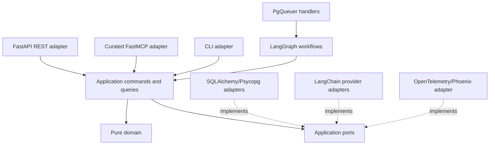

# Architecture — 2026 Agent Workflow

Condensed from BMAD's architecture spine (now deleted). Companion to [2026-scope.md](2026-scope.md) — that doc has the why/what and the "deferred, not killed" list; this one has the how.

## Stack

| Name | Version |
| --- | --- |
| Python | 3.14.6 |
| uv | 0.12.1 |
| PostgreSQL | 18.4 |
| LangGraph | 1.2.10 |
| langgraph-checkpoint-postgres | 3.1.1 |
| PgQueuer | 1.3.2 |
| SQLAlchemy `[asyncio]` | 2.0.51 |
| Alembic | 1.18.5 |
| Psycopg `[binary]` | 3.3.4 |
| FastAPI | 0.141.1 |
| FastMCP | 3.4.5 |
| Uvicorn | 0.52.0 |
| langchain-core / -openai / -anthropic | 1.5.3 / 1.4.1 / 1.5.3 |
| Pydantic | 2.13.4 |
| OpenTelemetry API/SDK | 1.44.0 |
| OpenInference LangChain instrumentation | 0.1.68 |
| Phoenix (self-hosted, ELv2) | 19.11.1 |

## Layout

```text
backend/
  src/pricecomp/
    contracts/     # framework-free v1 values, stage envelopes, errors
    catalog/       # source identity, imported facts, shelf price
    taxonomy/      # category tree, membership, hygiene
    enrichment/     # cited traits, quantities, normalized values
    review/        # deferred items, read-only surface, CLI re-drive
    pipeline/      # runs, stages, LangGraph workflows
    comparison/    # derive-on-read comparison queries (no owned state)
    evaluation/    # Phoenix datasets, evaluators, experiment tasks
    platform/      # REST, MCP, CLI, dispatch, persistence, LLM, telemetry adapters
  migrations/      # Alembic
  tests/{domain,integration,contract,evals}/
frontend/
legacy/            # frozen old TypeScript backend + data importer
```

Hexagonal, vertical-package monolith: `catalog`/`taxonomy`/`enrichment`/`review`/`pipeline`/`comparison`/`evaluation` are pure domain + application code with **zero** imports of FastAPI, SQLAlchemy, LangGraph, LangChain, PgQueuer, Phoenix, or OpenTelemetry. All of that lives in `platform/` adapters. Domain operations take facts and return new state/rejection/events; transactions, clocks, IDs, and telemetry are the application/adapter layer's job.



**One command owner per mutable concept:** catalog owns source identity/observations/shelf price; taxonomy owns the tree/membership/comparable-unit policy; enrichment owns cited traits and quantity revisions; review owns deferred items; pipeline owns run/stage coordination. `comparison` owns **no state** — it's derive-on-read queries only, run inside one repeatable DB snapshot.

## Runtime & process

- One backend image exposes `api`, `worker`, `migrate` commands. No Redis, no separate workflow runtime — PgQueuer + LangGraph checkpoints live in the same Postgres instance.
- **Single operator, single worker in MVP**, enforced mechanically: a worker takes a Postgres advisory lock at startup; a second worker exits with a distinct error instead of running. This is what lets us skip taxonomy compare-and-set, generation watermarks, leases, and fencing tokens for now — that machinery comes back the moment a real second writer shows up.
- PgQueuer dispatches durable work (pipeline runs, re-drive, maintenance, cleanup). Enqueue happens **after** the triggering transaction commits; handlers are idempotent, so a lost or duplicated enqueue is safe — no transaction-joining producer bridge. Work states: `pending`/`running`/`retry_wait`/`completed`/`failed`/`cancelled`. Retry: 5 exponential-backoff attempts with full jitter, capped at 15 min, for *transient infra* failures only — a deterministic `invalid`/`defer` outcome never auto-retries.
- **Command-only mutation.** Every business operation goes through exactly one application command handler in one Unit of Work. No adapter — REST, MCP, CLI, agent, LangGraph node, job handler — touches SQL directly, and none may chain several commands to fake one atomic op.
- **Idempotency.** Commands are keyed by `(command_type, caller, key)` plus a canonical payload hash. Replaying a known key returns the stored terminal result rather than re-running side effects; the same key with a changed payload is rejected.

## Catalog & ingest

- One ingest-selection primitive filters by source category or keyword: bulk = empty filter, single = filter-of-one, filtered = the general case. All three run the identical pipeline — no mode-specific branch anywhere.
- Durable source identity is `(source_namespace, source_product_id, optional source_variant_id)`, unique with `NULLS NOT DISTINCT`. Product name and URLs are mutable *observations*, never identity. A source record without a trustworthy stable ID must explicitly defer/fail — never fall back to name/URL to synthesize one.
- Each import batch is an immutable catalog snapshot (source-observed time in UTC, checksum, adapter version).
- Ingest replaces imported facts only for the products it actually observed; everything else is untouched. No "this snapshot is complete" assertion, no absence-based deactivation — add that only once a source that genuinely delists products shows up.
- **D6 (hard rule): product upsert can never write enrichment state.** This was a real bug in the legacy importer — re-import silently wiped LLM-extracted attributes. Needs a dedicated non-wipe regression test, always.
- Shelf price is revisioned by kind (`regular`/`promo`/`per_unit`), at most one current row per kind, deterministic selection rule.

## Taxonomy

- One rooted tree — no cycles, no self-parenting, no graph/lateral edges. A comparison-eligible product has exactly one active leaf membership, enforced by DB uniqueness.
- Substitutability ("would a shopper treat these as interchangeable?") is defined by a **prose rubric + few-shot same/not-same pairs** — never by embedding clusters, and price comparability is never a membership criterion.
- **Leaves** = consumer-fine granularity, the default compare unit. **Facets** filter within a leaf (organic, fat%, brand tier...) without creating a new leaf. **Parents** widen compare scope (e.g. fresh vs UHT milk via the `cow milk` parent) — but only when the ancestor declares a comparable unit compatible with its descendants; otherwise return a typed "not comparable" result, never a fabricated cross-unit ranking.
- Import/source categories (the retailer's own taxonomy) are ingest filters only — never a comparison primitive.
- Assignment searches existing categories/membership before creating; creates for real when nothing fits (no provisional/draft category state, no silent merge from name similarity alone).
- Hygiene command set: merge, rename, edit, reparent (incl. create-parent), reassign, flag for review, and leaf-coherence repair. Category-affecting mutations upsert one coalesced review-request row per affected category; **one post-bulk hygiene pass** (not scheduled) claims and clears the rows for categories a run touched.
- Agents get category context by **searching** the taxonomy through the command layer — never by dumping the full tree or a parent subtree into a prompt. Hard token-budget constraint, not an optimization.

## Traits, quantities, comparable price

- Extraction is deterministic-first: try `unit`, then `price_text`, then the product name. A high-confidence deterministic hit skips the LLM entirely; the LLM only runs on residual/low-confidence/empty cases.
- Every accepted non-null trait or quantity carries evidence: source field, verbatim substring, a SHA-256 hash of that field's text at extraction time, and the extractor/prompt version. A validator rejects any uncited non-null trait. `unknown`/`defer` route to the deferred-items queue instead of a guess.
- Quantity kinds: `net_content`, `item_count`, `price_basis`. Selection order: deterministic `price_basis` (source states a unit price) → deterministic `net_content`/`item_count` → inferred equivalents; conflicts defer.
- Compare leaves require a `preferred_comparable_unit` (+ optional secondaries). **Normalized price = `shelf_price / quantity_in_preferred_unit`, derived on read** from the current shelf-price + quantity revisions — no cache column, no indexed comparison projection (build one only if read latency is actually measured to be a problem at real catalog size). Results always carry currency + unit; mixed-currency queries fail closed; missing/unconvertible → null + defer, never a fabricated conversion.
- A rare per-SKU `comparable_unit_override` exists for genuinely odd products — treat it as review-worthy, not routine.

## Non-blocking human review

- One Postgres `deferred_items` table (product ref, stage, reason code, attempt count, payload snapshot, trace ID, status) holds every `unknown`/`defer`/low-confidence outcome. The pipeline never blocks on a human.
- MVP review surface is **read-only**: list + inspect + Phoenix trace link, plus a CLI `re-drive` command that re-invokes the original command handler. In-app writes (reassign, edit trait, accept/reject evidence) are deferred until the read-only queue proves worth acting on in-app.

## Pipeline & agent orchestration

- Discover/create → assign → extract run as three separately-prompted stages, each independently scored. Same-call create+assign is structurally impossible.
- LangGraph owns MVP orchestration. Every run/stage-execution/attempt gets a durable ID (`pipeline_run_id`, `stage_execution_id`, `stage_attempt_id`). Before a command applies its effect, the stage stores its outcome + request fingerprint + config versions in Postgres; a replay reapplies that *stored* outcome instead of silently calling the LLM again. LangGraph's Postgres checkpointer holds orchestration state only — never a second business database.
- Agent capability surface starts as MCP/tool calls, as a thin adapter over the shared command layer. Escalate to something heavier (CLI-style surface, code execution) only if tool-definition token cost or context bloat becomes a *measured* problem.

```text
REST / thin MCP / CLI
  → shared application commands
  → PgQueuer job (enqueued after commit, idempotent handler) → LangGraph workflow
  → discover/create | assign | extract
  → category search + product supply
  → deterministic validators + evidence_span; unknown → deferred queue
  → owner-specific transactional writes (import can never reach enrichment state)
  → normalized comparable price derived on read
  → coalesced taxonomy review requests → post-bulk hygiene
  → non-blocking review: read-only dashboard + CLI re-drive
```

## Observability & eval

- Self-hosted Arize Phoenix (own Postgres database) is the only trace store, dataset/experiment home, and run UI — no custom trace viewer.
- Domain/application code owns a thin telemetry port; OpenTelemetry itself lives only in adapters.
- Cost tracking needs `llm.provider` plus a matching Phoenix model-pricing entry, or cost silently reports as $0 — treat that as a setup check, not an assumption. Aggregate leaf LLM spans only; parent-span aggregation double-counts tokens.
- Two LLM provider adapters (OpenAI, Anthropic) via LangChain chat models. Add a third only if a real model comparison needs one.

## Cutover from the legacy TypeScript stack

- Fresh rebuild: new databases, replay one immutable source manifest through the Python importer, no legacy AI-derived state carried over. Legacy stays read-only; the frontend keeps talking to the legacy API until the new stack covers it. Recovery is "run the replay again" — no freeze/restore drills or gated rollback ceremony, because everything is reproducible from source.
- `/backend` is the Python monolith root; `/legacy` holds the frozen old TypeScript backend + data importer; `/frontend` is unchanged.

## Data conventions

- UUIDv7 for every application-owned entity ID (time-ordered — fine since nothing here is privacy-sensitive). External source IDs are a separate typed uniqueness key, not a second ID type.
- UTC `timestamptz` storage, RFC 3339 wire timestamps, ISO 4217 currency, `NUMERIC(24,12)` decimals (string-encoded in JSON, round-half-even only at presentation boundaries), lowercase `snake_case` enums.

---
For what's intentionally out of scope for now (and when to revisit it), see [2026-scope.md § Deferred from MVP](2026-scope.md#deferred-from-mvp-deferred-not-killed) and § Won't build below.

## Won't build

Options considered and rejected, not just deferred:

- Full/parent-subtree taxonomy dumps into prompts; keyword-only category matching.
- Dumping the whole product batch/catalog/source-category into one prompt; including already-assigned products in supply context.
- Pure prompt-chain orchestration with no tools.
- Blocking wait-for-human HITL; zero-HITL; sample-audit-only review.
- Embedding-cluster-then-label as the substitutability definition; price comparability as a membership criterion.
- Free-text brittle parsing without a deterministic validator; a second LLM pass over free text.
- Natural-text → parse → save without typed intermediate state; staging/promote tables; append-only event log as the primary persistence model.
- Same-call assign+create; human-approve-only assignment; delta-only or soft/hard two-phase assignment.
- Human-gated, assign-only, search-miss-only, or draft-publish category creation modes.
- Auto-merge from name/embedding similarity alone; human-only merge; never-auto merge.
- SKU-fine, department-coarse, or price-variance-adaptive granularity as the MVP default.
- Forcing every product into one category-wide unit (no per-leaf preferred unit).
- Provisional/draft category lifecycle; taxonomy as a graph with lateral "also comparable" edges (unless tree + facets prove insufficient in practice).
